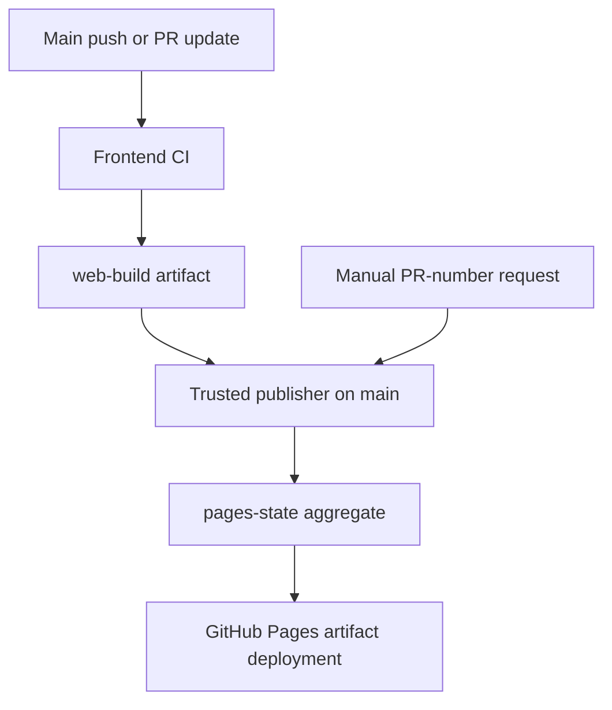

# Deployment architecture

## Publication recovery — #44

The shared publisher uses `concurrency.queue: max` with `cancel-in-progress: false`. GitHub retains up to 100 pending publishers rather than replacing the single pending run. Queue capacity, manual cancellation and deployment failures still require reconciliation; queue order is not a source-freshness guarantee. See [GitHub concurrency documentation](https://docs.github.com/en/actions/how-tos/write-workflows/choose-when-workflows-run/control-workflow-concurrency).

On main, a scheduled recovery runs at minutes 17 and 47 each hour. GitHub schedules are best effort and can be delayed or dropped; this is not a delivery-time SLA. Recovery examines up to 300 completed main push runs of `ci.yml`, requires a successful **Validate and build website** job and an unexpired `web-build`, and applies the existing same-repository/current-main or verified documentation-only-descendant checks. A cancelled or failed overall CI run can therefore recover a successful frontend artifact without accepting a failed frontend build. Downloaded SHA/run identity is still verified before copying static files.

Recovery also retires closed published previews while preserving production and open previews. An aggregate-only reconciliation needs no build artifact. Stale production requests cannot overwrite newer production, but their retirement work is retained. Documentation-only pushes still skip their dependent publisher; scheduled reconciliation may publish a newer validated artifact or cleanup independently.

`pages-state/.deployment-state.json` records desired aggregate content. `.publication-receipt.json` is written **only after** successful Pages deployment and records the acknowledged aggregate state. A committed site without a matching receipt is republished on recovery, even if its generated files have not changed. An acknowledged current site with no closed previews is a no-op. Artifacts cannot supply either state file; both are reserved paths. API errors fail visibly rather than being treated as successful publication.

For immediate recovery, rerun the cancelled publisher/CI or dispatch **Publish website** on main with a blank PR number after green CI. If artifacts have expired, run fresh main CI; recovery does not bypass trust checks. If newer website changes have no successful frontend artifact, fix their CI first. Check the deployment summary and live `build.json`/`deployment.json`; a saved branch alone does not prove a live deployment.

Local regression coverage includes cancelled publishers, deployment failure before receipt, closed/open preview coexistence, stale production plus retirement, failed frontend jobs, expired artifacts, foreign sources, source freshness and acknowledged no-ops. Live overlapping main/preview/retirement acceptance remains pending until the workflow is merged and run on main. #44 remains open for that evidence; #26 remains the parent delivery tracker. Staging and immutable versioned promotion remain #130 and #32.

## Current workflow refinement — #100

Implementation in the Preparation milestone (#78). Frontend CI remains unconditional on main pushes and PR updates, preserving required checks and current-head preview artifacts. After a successful website-affecting main build, CI calls pages.yml as a dependent reusable job using its own run ID and artifact. The separate workflow_run publisher subscription is removed. Docs/tracker-only main builds finish validation without a publishing workflow run; the dependent publication job is skipped. Manual Publish website remains available on main for numbered PR previews or production recovery.

Automatic Browser E2E executes only for a non-draft PR from `release` or `release/*` targeting `main`, when opened directly for review or transitioned from draft to Ready for review. Feature/staging PRs cannot execute the browser job. Pushes, synchronize/reopened events and manual dispatch are not triggers. To retest a changed release candidate, return its PR to draft and then mark it ready again. Whole-PR docs-only path filtering remains; local Playwright commands remain available for deliberate debugging. Ordinary Frontend CI continues unit/pipeline/lint/type/build validation. GitHub's PR branch filter matches the base branch, so the head-branch restriction is enforced by a job guard; a feature-to-main readiness event can show a skipped workflow, but does not execute browsers.

Publication still checks source SHA/run identity, current-main eligibility, stale-build protection, aggregate preview preservation and retirement. Main CI does not cancel an active main publication when another push arrives; PR CI remains cancelable. #44 adds the queued publisher and scheduled recovery described above. Automatic deployment appears under Frontend CI → Publish validated production build / publish; standalone Publish website handles manual dispatch and scheduled recovery. Failed frontend validation cannot call publication. No duplicate production build is introduced.

Validation: nine pipeline tests pass locally, including real Git diffs for docs-only/application changes and source→docs renames, workflow dependency/permission boundaries, current-run binding, whole-PR mixed changes, manual dispatch and existing artifact/preview safeguards. Remote CI must pass before review; Browser E2E is now a reviewed release-to-main acceptance gate (#129). Actual docs-only/main/preview behavior requires post-merge run evidence before #100 closes. #106 documentation reorganization follows; no files are moved in this implementation.

Updated: 1 October 2026. Implemented: #31/#35/#39 in PRs #33/#36/#38/#40. Release promotion: #32. Queue reliability follow-up: #44.

## Trust and artifact flow

CI checks out source with read-only repository permissions, installs pinned dependencies from the lockfile, runs quality/type/tests/build and records source SHA plus CI run ID. It builds the production or preview base path. The publisher checks out main and uses scripts from main; artifact files are copied as static content and are not executed.

## Channels and selection

| Trigger                                        | Result                                                       |
| ---------------------------------------------- | ------------------------------------------------------------ |
| Website-affecting push to main, successful CI  | Publish production root                                      |
| Documentation-only push to main, successful CI | Artifact publish=false; automatic publisher skips deployment |
| Open PR update, successful CI                  | Validate only; no automatic preview update                   |
| Manual Publish website with pr_number          | Select current successful same-repo PR head targeting main   |
| Manual request with blank number               | Republish a successful main artifact                         |
| Closed/merged published PR                     | Retire during actual publication or scheduled reconciliation |

Failed builds do not publish. Stale PR heads, unsupported events and unrelated/fork sources are rejected or skipped. PR artifacts expire after seven days; rerun CI if the current artifact is unavailable.

A manual preview remains on its published commit until manually updated. The footer records PR, source branch and commit for the compiled artifact. Production footer identifies main and its source SHA.

## Aggregate state and paths

pages-state contains generated HTML/assets, preview/pr-N directories and .deployment-state.json. It is not a development branch. The publisher preserves unrelated channels when replacing one channel, then uploads the full combined site through official Pages artifact actions.

Production: /papertrail-reader/. Preview: /papertrail-reader/preview/pr-N/. Build identity: build.json. Aggregate deployed identity: deployment.json. Vite base paths are supplied in CI; hash routing delivered in PR #41 avoids Pages rewrite requirements.

Retirement replaces the PR folder with self-contained styled HTML, preserving a navigable URL and linking ../../ to production. Older retired pages keep their previous design until retirement is rerun. PR builds include preview-closed.html as a clearly labeled design sample.

## Concurrency and recovery

See Publication recovery above. The original incident cancelled pending production run 36894992262; retry publisher 36895563022 recovered production. The new workflow retains a larger queue and reconciles desired state with a successful-deployment receipt.

## Remaining acceptance

#35 has one remaining live check: documentation-only main publishing must skip. The docs-only audit PR is the controlled test. After its merge, verify green push CI, artifact publish=false, skipped Pages deployment and unchanged production SHA.

#32 implements immutable versioned release URLs, tag/version validation, checksummed artifacts, promotion and rollback. Those capabilities are not implemented. Current rollback is a reviewed revert on main with successful CI/deployment.

## Source and maintenance

See .github/workflows/ci.yml, pages.yml, scripts/build-info.mjs, deploy-policy.mjs and assemble-pages.mjs. Keep this document and deployment-verification.md updated when triggers, artifact trust, paths or recovery rules change.

## Deferred publishing chore — #100

Roadmap 2 #78 owns #100: prevent documentation-only merges from creating Publish website runs. The current workflow starts after successful main CI, then skips deployment for docs-only inputs. Owner explicitly deferred event-level filtering/orchestration until the next roadmap; #100 is not a v1.0.0 blocker. Current workflow triggers remain unchanged during #89.

## #101 deployment evidence

PR #101 merged as 77b8f311a638ba616a19dea0102833167a5453fa. #89 is completed. Main CI 37050685881, issue reconciliation 37050685625 and publisher 37050755788 passed; pages-state metadata identifies production 77b8f31/source CI 37050685881 and preview #101 is retired. This verifies deployment/source metadata, not an additional interactive production audit. Final application/test 48c4295 passed CI 37050069997 (87 unit, 6 pipeline tests) and Browser E2E 37050221708 (81 passed without retries, four intentional duplicate long-document skips). The selected-occurrence screenshot confirms alignment with painted PDF text. Final documentation evidence follows separately because #101 was merged during recording. #79/#1/#80 remain open for final first-release regression and v1.0.0 preparation; version remains 0.1.0. Chore #100 stays deferred under Roadmap 2 #78.

---

[Previous](reader-shell.md) · [Documentation home](../README.md)
