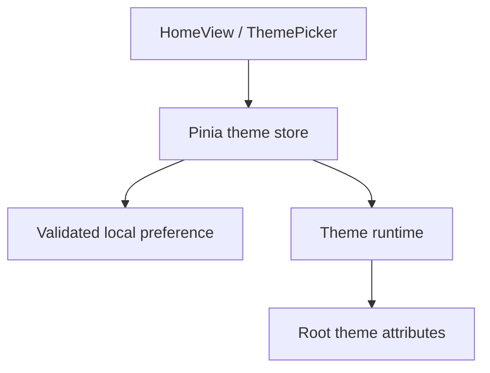

# Vue application architecture

## Workspace restoration delivery — #118

PR #119 merged the workspace metadata repository, permission/access service, fresh document revalidation and continuity composable. Accepted source `deed40b` passed native-handle reload, normalized anchor/zoom/panel restoration and changed-content rejection in Browser E2E 37138156717. Native lifecycle tests use full Chromium with a temporary normal profile; real OPFS handles and IndexedDB are exercised, with a fixture-supplied picker. OS permission prompts are not certified by that fixture. Application storage contains metadata and handles, not PDF bytes. #115 adds bookmark operations over the same resolved document identity; bookmark UI state belongs in a separate composable.

## Named PDF bookmarks — #115

Bookmark metadata shares the `papertrail-reading` document store and its resolved UUID with reading positions. `services/reading-database.ts` owns short-lived atomic transactions; `reading-storage.ts` resolves document identity and saves positions, while `pdf-bookmarks.ts` validates and loads/adds/renames/removes bookmark records. Each bookmark contains a UUID, a trimmed name of at most 120 characters, a normalized PDF anchor and creation time. Existing document records gain an optional bookmarks array; database version 1 and existing reading-record versions 1/2 remain compatible. Atomic edits preserve reading position/view metadata and position saves preserve bookmark metadata. Missing document records are not resurrected after storage clearing.

`useReadingContinuity` exposes the unambiguous resolved document UUID. `usePdfBookmarks` owns list/loading/mutation state, duplicate-action suppression, stale-result rejection and accessible storage notices. No identity means disabled bookmark editing; failed edits preserve drafts, with retry/reselection guidance. The service permits at most 500 bookmarks per document and ignores malformed saved entries.

`PdfBookmarksPanel` provides named creation, inline rename, removal and navigation in the existing right utility panel, with keyboard labels, focus recovery and wrapping names. `PdfReaderWorkspace` captures the viewport-center anchor and applies navigation when the target page is ready, retaining current zoom/fit. Bookmark panel selection is retained by workspace restoration. Identical content after renaming reuses the resolved identity; changed files receive separate bookmarks. Forget library preserves this metadata; clearing browser storage removes it. Bookmarks are local PDF metadata only; EPUB CFI, sync, export and multi-document tabs are separate work.

Validation for this branch: local lint/format/type/build, 115 unit/component and 10 pipeline tests pass. [PR #120](https://github.com/HimanshuHD/papertrail-reader/pull/120) application/test source `793adcdc` passed Frontend CI 37140924880 and Browser E2E 37140988461: 97 browser cases passed, eight intentional skips, no retries. Named anchor navigation, rename/remove, reload/reselection and changed-content isolation passed at all five widths; storage-clear recovery passed at desktop width. See [inspected bookmark evidence](../evidence/pdf-bookmarks.md). Owner review and merge remain pending.

## PDF continuity service boundaries (#13 / #114 / #117)

`services/pdf-reading-state.ts` validates view settings. Record version 2 adds custom zoom and fit mode; version-1 page-only records migrate lazily under their original identity, without changing the IndexedDB database version. Fit modes remain responsive to the current viewport. Restore awaits identity/settings before mounting pages, navigates behind an opaque loader, and reveals the reader only after the target bitmap and layout are ready. Scroll-based page detection and persistence stay disabled during restoration. Cancellation retains the document/session generation guard.

The first Reading continuity increment keeps Vue components responsible for display and navigation. `useReadingContinuity` coordinates restore/save lifecycle, cancels stale identity work, debounces page changes, and flushes pending writes on document switches, unmount, page hide and hidden visibility. It never renders a PDF.

- `features/library/browser-selection.ts` and `discovery.ts` own browser access and enumeration; IDs here remain session-local.
- `features/pdf/pdf-session.ts` owns PDF.js loading, rendering, text and outline access.
- `services/document-identity.ts` lazily fingerprints only the opened file. SHA-256 digests every 1 MiB chunk and a size/version manifest, bounding temporary reads without preloading pages. Rename/path changes preserve identity; changed content creates a separate identity.
- `services/reading-storage.ts` owns version-1 IndexedDB metadata and generated UUIDs. Resolve/create is atomic in a read-write transaction; save updates only the selected identity. No bytes or permission-bearing handles are stored.
- `composables/useReadingContinuity.ts` exposes restore/save/reset and a user-facing storage notice. It queues writes to avoid late saves overtaking newer pages. Storage errors never prevent reading.

Restoration clamps pages to the current page count and does not override navigation made while identity resolves. Ambiguous or malformed records are preserved without guessing; automatic saves remain disabled for that selection. Clearing storage starts fresh after reselection. Browser origin and preview path share IndexedDB: identity matching uses content rather than deployment identity. Pending IndexedDB writes at abrupt process termination remain best effort.

Named PDF bookmarks are implemented in the #115 review branch; EPUB locations follow #12. Reading metadata includes page, zoom/fit mode and an optional normalized viewport-center anchor. Existing page-only/view records remain compatible.

## Single-workspace restoration (#118)

- `services/workspace-storage.ts` owns the separate `papertrail-workspace` IndexedDB database and validates a single metadata snapshot. Cached documents have paths, titles, size and modification time, with no File/Blob or PDF bytes. Native directory handles are structured-cloned only when available.
- `services/library-access.ts` queries read permission during startup. Only an explicit Resume library gesture requests renewed permission. File-input sources and unsupported/missing handles require source reselection; the cached listing remains visible with unavailable document buttons disabled.
- `services/workspace-revalidation.ts` matches unique paths from fresh enumeration and checks file metadata plus full content fingerprint before automatic reopening. Changed, missing, moved or ambiguous paths require explicit selection. Cached identities never authorize an unrelated file.
- `composables/useWorkspaceContinuity.ts` serializes/debounces workspace writes, cancels stale startup loads and permission results, flushes on page hide/unmount, and orders Forget before newer library writes. Storage failure leaves ordinary reading available with an accessible notice.
- `ReaderView` connects fresh discovery and revalidation to UI state. Tree nodes receive controlled collapsed paths; the library listing owns its independent scroll container. Sidebar visibility/width, selection, library scroll, and the contents/search utility panel persist. Search results are regenerated from the verified PDF; transient popovers and result objects are not saved.
- `useReadingContinuity` and the existing reading repository retain the document's page/view/normalized anchor independently. The renderer reserves the restored utility-panel layout, navigates behind the opening loader, waits for the target bitmap, and restores the anchor before revealing pages. Zoom stays custom when saved as custom; fit modes adapt to the current viewport.

Forget library removes the saved workspace and handle references, stops active enumeration and closes the current PDF. It deliberately keeps reading metadata so selecting a PDF later can still restore its position. Browser clearing/site-data removal removes both databases. Closing a process abruptly can still interrupt a final asynchronous write; no durability beyond browser storage is promised.

Automatic reopening applies to granted persisted directory handles on supporting browsers. Standard folder/file inputs do not provide durable handles and require reselection. Selecting the same named source verifies the saved path and fingerprint again before reopening; selecting a different source starts a new workspace. No folder picker opens automatically, no document bytes are retained, and multi-document tabs remain Roadmap 3.

Updated: 2 October 2026. Owner: #1. Foundation: #3/#22. Completed increment: #6 / merged PR #41.

## Current reader UI increment

LoadingState and abortable discovery timing were merged in #97 (#85). PR #98 groups #86/#87: visible utility-mode state, page-field focus clearance, icon-only theme header, compact semantic footer and shared transition-surface lifecycle hooks. Entering surfaces restore accessibility/interactivity; exiting surfaces become inert and aria-hidden while remaining painted for motion. Timing/reduced-motion/focus details and browser evidence are recorded in [reader-polish.md](../evidence/reader-polish.md). These fixes are merged and verified by production source metadata. #89 search excerpts/highlighting is merged in PR #101; final PDF regression follows before release. Persistent reading data and EPUB remain Roadmap 2 scope.

## Historical implementation status after PR #60

| Layer           | Implemented on main                                            | Remaining owner                     |
| --------------- | -------------------------------------------------------------- | ----------------------------------- |
| App/root        | Shared footer, HomeView and ReaderView through RouterView      | PDF UI follow-ups #62–#64           |
| Styling         | Tailwind semantic Light/Dark tokens and responsive shell       | Product-specific reader states      |
| State           | Theme, library state and active PDF reader state               | PDF UI state #64; PDF metadata #13  |
| Routing         | Hash home/app/fallback with Vite BASE_URL                      | Future document routes as needed    |
| Reader contract | PDF.js core reader #10 plus EPUB CFI/font contracts            | PDF UI follow-ups #62–#64; EPUB #12 |
| File access     | Source selection #8, discovery #24 and tree/refresh #25        | Persistent identity #13             |
| Persistence     | Light/Dark choice in localStorage; no reading-data persistence | #13                                 |

#6/#46/#42/#49/#43/#8/#24/#25 are merged. M2 browser selection, discovery, hierarchy and refresh/reselection are complete. Local-document selection now hands a `File` toward the reader boundary; PDF.js core #10 and utilities #11 are implemented; EPUB #12 is deferred to the next version.

## Implemented foundation flow (#6)

| Module                            | Responsibility                                     | Boundary                                           |
| --------------------------------- | -------------------------------------------------- | -------------------------------------------------- |
| src/App.vue                       | Root view composition and footer                   | No file enumeration or reader engines              |
| src/views/HomeView.vue            | Foundation content                                 | Calls UI controls, identifies unavailable features |
| src/components/ThemePicker.vue    | Labeled System/Light/Dark selection                | Calls the theme action                             |
| src/stores/theme.ts               | Preference, OS appearance and resolved theme       | Does not manipulate reader content                 |
| src/services/theme-preferences.ts | Validate/read/write papertrail.theme.v1            | Storage failure returns a session-safe fallback    |
| src/services/theme-runtime.ts     | Apply theme, listen for OS changes, return cleanup | Started before mount, disposed during HMR          |
| src/router/index.ts               | Hash routes under import.meta.env.BASE_URL         | No host rewrite dependency                         |
| src/types/reader.ts               | Format-specific adapter types                      | Not an engine implementation                       |

Light/Dark are explicit choices; System mode is removed in #46. Missing, invalid and legacy System storage values fall back to Light. Blocked storage does not stop theme changes. Theme choice is intentionally shared by production and previews on the same origin; future reading metadata must be namespaced by base path.

## UI architecture work for #7

- #42: component boundaries, responsive sidebar/workspace/toolbar and clearly labeled demonstration content.
- #43: keyboard/focus behavior and empty/loading/error/demo state presentation. ReaderView owns transient shell presentation and announcements; ShellStatus renders explicit view-only states. Escape from the library closes it and restores focus to the toggle. These states do not model file selection, indexing or reader services.
- #37: real-browser E2E infrastructure and acceptance execution, rather than duplicating it in both UI children.

#7 and #37 are completed after explicit browser acceptance in run 36924070741. Each child PR must record component ownership, props/events, state transitions, accessibility evidence and the related docs changes.

Components should render state through explicit props and emit user intent. Application services or Pinia actions own workflows. Reader/library services own document work. Do not let the sidebar access the filesystem directly, or couple the root component to PDF.js/epub.js.

## Planned provider and reader layers

Browser source selection starts in #8 with `src/features/library/browser-selection.ts`, which feature-detects the native directory picker, normalizes picker failures and preserves raw directory handles or selected `File` objects. `LibrarySourcePicker.vue` owns user-triggered controls and browser fallbacks. #24 adds `src/features/library/discovery.ts`: it consumes that selection, recursively traverses approved directory handles or snapshot `File[]`, filters PDF/EPUB case-insensitively, preserves relative paths, yields during large scans, supports `AbortSignal`, and returns partial documents plus recoverable per-path problems. `ReaderView` owns the current discovery controller/progress/result and passes only presentation data to the sidebar. Hierarchy rendering, refresh and reselection UI completed in #25 / merged PR #57.

PDF and EPUB engines will share lifecycle/navigation/progress/contents boundaries but expose different controls. PDF uses fixed pages and zoom/fit; EPUB uses CFI locations and typography. Reader adapters must release worker/render tasks and Blob URLs when switching. IndexedDB migrations, identity reconciliation and stored positions belong to #13.

## Documentation practice

Update this document and architecture.md when ownership or public contracts change. Update tests and issue/PR references together. Record accepted architecture decisions separately from planned work; preserve the roadmap PDF as a planning snapshot.

## Appearance refinement (#46)

The sun/moon button uses native button keyboard activation, aria-pressed for Dark mode, a visible focus ring and decorative SVG icons. Pinia contains Light/Dark only; theme-runtime watches explicit state with no matchMedia listener. Existing Light/Dark preferences persist; legacy System resolves to Light. This supersedes the original #6 System behavior.

## Reader shell and entry (#42/#49)

HomeView remains the foundation landing page, with Go to app routing to ReaderView at /app. ReaderView owns sample selection and sidebar visibility; layout/library/viewer children use explicit props/events and slots. See [shell-layout.md](reader-shell.md) for module ownership and responsive rules. #43 completed the accessibility/status increment in merged PR #53; #37 completed explicit browser acceptance after PR #55. Status state is view-only: future library/reader services expose workflow state through their own contracts rather than mutating shell presentation directly.

## Browser discovery increment (#24)

`discoverDocuments` is UI-neutral. Its normalized `DiscoveredDocument` identity is session-local only; persistent document identity remains #13. Individual-file fallback stays flat even when browser `File` objects originated elsewhere. Directory-input snapshots may use `webkitRelativePath`; approved directory handles are walked recursively from their granted root without exposing or inventing absolute paths.

Discovery cancellation stops PaperTrail's application-level traversal and returns partial results. It does not claim to cancel picker/OS enumeration that already occurred before files reached the app. Read/enumeration failures are recorded per path so usable documents survive isolated access failures. #25 consumes these normalized results to build the visible library tree.

## Browser library tree increment (#25)

`src/features/library/library-tree.ts` reconstructs presentation hierarchy only from normalized `DiscoveredDocument.parentPath`; it never invents absolute paths. Directory-backed and directory-input selections can render nested folders, while individual-file fallback remains flat. `LibraryTree.vue` and recursive `LibraryTreeNode.vue` own presentation/expansion; `ReaderView` owns selected local document identity and restores it after a live-handle refresh by exact session ID or a unique relative-path match.

Refresh semantics follow the browser source boundary. A live `FileSystemDirectoryHandle` can be rescanned in the current session. Directory-input and individual-file snapshots expose explicit reselection controls instead of implying live filesystem access. Selecting a local PDF opens the #10/#11 reader. EPUB opening remains #12 in the next version.

## PDF reader increment (#10)

`src/features/pdf/pdf-session.ts` owns PDF.js loading, the bundled worker URL, document lifetime and cancellation of an obsolete `RenderTask`. It accepts only an explicitly selected local `File`; no network URL or unrestricted filesystem path enters the reader. `PdfReaderWorkspace.vue` owns current-page, zoom and fit presentation while `ReaderView` decides when a discovered PDF becomes active. Changing sources, refreshing a live directory or selecting a sample/EPUB unmounts the PDF workspace so the session can release render/document resources.

`PdfReaderWorkspace.vue` renders a continuous page list and keeps current-page/progress synchronized from page visibility. `PdfPageView.vue` uses `IntersectionObserver` with a prefetch margin so canvas/text rendering starts only near the viewport; zoom/fit changes rerender nearby pages. The session tracks render tasks per canvas, so one visible page no longer cancels another and obsolete work for the same page is cancelled before replacement. PDF.js `TextLayer` overlays selectable text using `streamTextContent()`. Password callbacks fail into an explicit recoverable state rather than leaving document loading pending, and malformed PDFs surface an invalid-document state. PDF outlines/search/selection UX/fullscreen/shortcut help are implemented in #11 / PR #60.

## PDF utility increment (#11)

#11 extends the existing `PdfDocumentSession` rather than introducing a second PDF path. The session exposes read-only outline resolution and text search over PDF.js text content; rendering, worker lifetime and cleanup remain owned by #10. Search returns page-scoped excerpts and a searchable-text page count so image-only/scanned PDFs can be explained without implying OCR support.

`PdfReaderWorkspace.vue` owns Contents/Search/Help presentation, fullscreen state and keyboard shortcuts. Shortcuts are ignored while focus is inside editable controls except Escape, so typing and browser text selection remain native. Selecting a result or outline entry uses the existing page navigation path. Persistent search history, bookmarks and document identity remain outside #11.

## PDF UX follow-up ownership

#62 constrains /app to the viewport and assigns scroll roots independently to library and PDF workspace, including lazy-page observers and page tracking. #63 owns library header refresh/plus/close controls and the closed-panel floating opener; the existing selection service remains the file-access boundary. #64 owns a togglable right panel for outline/search results plus compact toolbar/popover presentation. Search entry/help popovers must restore focus and dismiss with Escape; icons retain accessible names and hover/focus tooltips. Long filenames use single-line ellipsis with a full-name tooltip.

The current release implements PDF persistence in #13 first; EPUB/CFI persistence follows next-version #12. These planned UI changes are recorded, not implemented by #61.

## Viewport and scroll ownership (#62)

App uses the reader route to apply a 100dvh frame with bounded footer; Home keeps its document flow. ReaderView owns the bounded flex app/header; ReaderShell owns independent library overflow and the remaining workspace. Below 1024px the library overlays the reading area inside the frame; above it a 280px split pane participates in the grid.

PdfReaderWorkspace owns the remaining-height PDF scroll root and bounded temporary header/utility overflow. ResizeObserver remeasures actual padded space on pane changes, with disconnect on disposal. Page navigation scrolls that root only. PdfPageView receives the root through a typed prop: its 700px prefetch observer controls rendering, while a separate zero-margin observer reports actual visibility for current-page tracking. Both disconnect on root changes/unmount. Keyboard scrolling from the library is not intercepted by PDF shortcuts.

## Compact library actions (#63)

ReaderView owns panel visibility and restores focus to the floating opener after closing; opening focuses the in-panel close button. ReaderShell renders the opener only when closed and retains the bounded library scroll root. LibrarySidebar has a sticky compact header and prioritizes the local tree after discovery. LibrarySourcePicker owns refresh capability, native/fallback inputs and the source dropdown. Hidden inputs stay mounted while its menu is closed. Escape dismisses the menu first, preserving the panel and returning focus to Add; arrow/Home/End navigation, outside pointer dismissal and Tab focus departure are supported. Pointer listeners are removed on unmount. IconButton/UiIcon share labeled, hover/focus tooltips with decorative SVGs. Snapshot refresh means explicit reselection; live directory refresh still uses the handle. #64 remains separate.

## Merged compact library refinement (#63/#72, PR #71)

The library opener, sliding panel transition, reduced-motion handling, and 308px default draggable/keyboard-adjustable width are implemented in the shell. PR #71 merged as 9e5db87a38673651214989053c495270ed9b73df; main CI 36998853805 and production publisher 36998900442 succeeded. Preview #71 is retired. See [shell-layout.md](reader-shell.md) for layout ownership.

## PDF utility workspace in progress (#64)

PdfReaderWorkspace owns transient PDF presentation state. The reader header keeps the document title on one truncated line with the full filename exposed by title and accessible name. IconButton/UiIcon render compact toolbar actions with visible labels on hover/focus and semantic button state.

A flex body places the independently scrolling PDF viewport beside a bounded utility aside. The aside switches between document outline and search results; on narrow screens it overlays the page viewport to preserve reading width. Search entry and keyboard help are anchored popovers, with Escape dismissal and focus restoration. The search popover closes after execution and restores focus to its trigger, keeping the first result clickable; result count/status stays in the right panel. Search query/execution and outline data remain in the reader workspace; the right panel only presents results and outline navigation. Switching/closing the PDF continues to abort pending search and release the session through the existing PDF service.

The implementation stays in the existing PDF reader component and shared icon system. ReaderToolbar remains the labeled placeholder for non-PDF sample content. Regression coverage belongs with the component tests and browser E2E; fullscreen, page navigation, search, outline and small-screen behavior must remain intact. Issue #64 and feedback #74/#75/#76 are implemented in review-ready PR #73. Browser E2E 37004063603 passed all 45 checks; successful searches close the popover and keep result status in the utility panel. EPUB stays deferred to #12.

## PR #73 preview feedback follow-ups

The search-overlap fix passed all 45 Chromium checks in Browser E2E 37001588269, following clean Frontend CI 37001493878. PR #73 addresses linked feedback: #74 toolbar tooltips/icons/cursors/page input, #75 search result timing and animated popovers (children of #64), and #76 removal of the PDF progress slider (child of #10, related #11/#64). Search opens only the popover; the results panel opens after successful completion, with a busy submit control during execution. Viewer scrolling and numeric/previous/next navigation replace the slider. Zoom SVGs use Lucide's Feather-derived designs with licenses in docs/licenses/lucide.txt; no runtime icon dependency is added. Popovers respect reduced motion. Validation on 7dc80c5: Frontend CI 37003984005 passed install, lint, formatting, tests, type checks and build; Browser E2E 37004063603 passed all 45 Chromium checks across 320/375/768/1024/1440 widths. The focused suite passed 23 checks including pending/failed searches, toolbar order and tooltip accessibility. PR #73 is ready for review; #64/#74/#75/#76 remain open until merge. No automatic PR publishing ran. Manual preview uses Publish website on main with pr_number 73.

## Current delivery boundary

First-release roadmap #1 delivers the existing browser PDF architecture after bug triage/fixes #79 and v1.0.0 release gate #80. #10/#64 and their completed UI/lifecycle follow-ups are merged. Persistence #13, EPUB #12, recents/annotations/tabs and native provider/Tauri work now belong to Roadmap 2 #78. This planning split changes no runtime architecture or current version. Earlier future-work ordering is superseded by docs/roadmap.md.

## First-release rendering bug #88

#88 (parent #79) is active on fix/88-pdf-scroll-rendering. Intersection changes previously restarted already-rendered canvases; offscreen viewport changes skipped invalidation, and placeholder geometry differed from final page size. The fix measures intrinsic page geometry without drawing, reserves scaled page bounds, invalidates offscreen pages, and draws only dirty pages. Per-page rendering is serialized; obsolete completions cannot publish state, and canvas/text are hidden until coherent drawing completes. Explicit white canvas background avoids transparent backing. Regression coverage exercises repeat intersections, offscreen resize, invalidation during rendering, and an eight-page real-PDF large-scroll-jump/resize workflow. Automated scrollTop jumps model scrollbar position changes; actual Windows scrollbar drag and the owner's affected document remain manual acceptance checkpoints. No specific PDF or OS/browser was supplied with the initial report.

#88 final review evidence: PR #90 head 14ef8e1 passed Frontend CI 37014694500 and Browser E2E 37014775675 (50 Chromium checks at five widths). The first browser run exposed a hidden last page after utility-panel resize at 1024px; preserving visible-page/end-scroll anchors fixed it without changing the regression. Original affected PDF, actual Windows scrollbar drag, both-theme/zoom preview review and merge remain owner acceptance checkpoints. #88/#79 remain open. Manual preview uses Publish website on main with pr_number 90.

## Additional PDF rendering acceptance (#91/#92)

PR #90 remains on fix/88-pdf-scroll-rendering for the owner's additional report. #91 (parent #79, related #88) preserves the displayed bitmap while a detached canvas/text layer prepares a replacement; it presents a first-render placeholder and adds scroll-event visibility checks as an observer fallback. #92 anchors zoom/fit to the normalized reading point and calculates zoom increments from the actual fit dimensions/current custom zoom, avoiding stale rendered-scale baselines. Native scroll anchoring is disabled inside the PDF pane so explicit anchors own the update. Old text selection is hidden during replacement until the coherent text layer is swapped in. Frontend CI 37017085639 passed on 30a2a8d; fresh browser zoom/fit and scroll regressions plus owner affected-PDF/Windows scrollbar validation are pending. Earlier acceptance evidence predates these changes.

Final #91/#92 review evidence: application head 5d84098 passed Frontend CI 37018694939 and Browser E2E 37018805847 with all 55 Chromium checks passing without retries. A queued resize-anchor race found by browser testing is resolved: newer navigation/zoom/fit or scrollbar movement invalidates older position restoration. Anchors use the actual page under the viewport center and its dimensions. The browser baseline now asserts completed page rendering before measuring reading-point stability. Earlier intermediate passing/failing runs are historical; this evidence supersedes their pending-validation statements. PR #90 is ready for owner affected-PDF/Windows scrollbar preview; #88/#91/#92/#79 remain open until acceptance and merge.

## Scroll tracking and local preview cache (#93/#94)

Additional owner reports are recorded under #79/#88 and implemented in the same draft PR #90. #93 measures visible page overlap on viewer scroll rather than relying solely on observer thresholds; Next/Previous synchronously refresh that state. #94 preloads every page's intrinsic geometry and low-resolution preview before opening the reader. PDF bytes were already read locally. Preview canvas backing pixels have a shared 32 MiB budget and maximum 192px long edge; full-resolution canvases/text remain lazy. This budget covers preview pixels, not total PDF.js/document/high-resolution memory. Cached previews provide immediate page content during scrollbar jumps and are cleared on session close. Preparation is sequential, yields between pages, reports progress and is aborted on document switch/unmount. Opening is slower for long/image-heavy files; the deliberate tradeoff is complete preview coverage before the reader appears. High-resolution drawing retains buffered replacement. Tests cover cache coverage/budget/disposal, preview display and scroll-driven header/navigation; fresh CI/browser and owner affected-PDF/Windows scrollbar checks are required.

Final #93/#94 evidence: PR #90 application head 74012c3 passed Frontend CI 37020773253 and Browser E2E 37020996456 with all 60 Chromium checks passing without retries. Scroll-to-page-six header synchronization, Next/Previous stepping and final-page disabled state are verified at five widths. Cache tests verify per-page coverage, progress, pixel budget and disposal; component coverage verifies immediate cached pixels while full-resolution rendering is pending. Owner affected-PDF/Windows scrollbar, large-document opening and switching checks remain preview acceptance before merge. Previous pending-validation statements are superseded by this result. #79/#88/#93/#94 remain open.

## Large-document performance follow-up (#95)

Current approach in PR #90 supersedes #94's blocking all-page preview preparation. The reader opens after PDF.js loads the document and measures page one; it does not rasterize or measure all 1,000+ pages before opening. Page-one dimensions reserve untouched page slots. Actual dimensions and full-resolution rendering are requested only near the viewport (700px margin). This avoids an eager getPage call for every mounted page. Mixed-size pages are measured when approached; distant slot geometry is initially estimated from page one.

Completed page pixels are downsampled into a 128-entry LRU cache, with a 192px maximum edge (less than 18 MiB of RGBA backing pixels). Cache creation reuses completed drawing rather than rendering every page a second time. Distant displayed canvases/text are released and obsolete in-flight drawing is cancelled. Revisiting a cached page shows its preview while sharp pixels are prepared. The previous bitmap remains visible during zoom replacement. File bytes remain local; this cache budget excludes PDF.js internal/document resources and active full-resolution canvases. An unvisited page shows a rendering placeholder until its first drawing completes; native Chrome performance parity is not claimed.

#95 is a child tracked by reciprocal links/checklists in #79/#88, related to #94. Tests cover 1,001-page opening without rasterization/all-page geometry requests, lazy viewport geometry, bitmap disposal, preview LRU eviction, and a 1,001-page first/last/revisit browser regression. Existing page-field/navigation and zoom/fit regressions remain. Fresh CI/browser evidence and manual affected-PDF acceptance are pending; previous 60-check evidence covers the superseded preload implementation. PR #90 remains draft until fast checks pass. No workflow trigger changes or automatic PR publication are included.

#95 validation: application commit 51bec7edb41436b5b1bf98c85af722f795085140 passed Frontend CI [37032576530](https://github.com/HimanshuHD/papertrail-reader/actions/runs/37032576530): 69 unit tests, 6 pipeline tests, lint, formatting, type checks and production build. Browser E2E [37032676748](https://github.com/HimanshuHD/papertrail-reader/actions/runs/37032676748) passed 61 checks without retries; four duplicates of the long-document test were deliberately skipped at other widths. Existing regressions ran at five widths. The 1,001-page desktop test verifies first-page readiness with fewer than ten allocated displayed canvases, jumping to page 1,001 with synchronized header and selectable text, and revisiting page one. Its complete test duration was 1.9s; this is not a benchmark of the owner's original document. No Publish website run was triggered for this application commit. PR #90 is ready for review. Republish manually using Publish website on main with pr_number 90; original large-PDF/Windows scrollbar, mixed-page-size and document-switch acceptance remain pending. #79/#88/#91/#92/#93/#94/#95 remain open until owner acceptance and merge.

## Library labels and independent list scrolling (#84)

LibrarySidebar owns a full-height flex column with a non-scrolling header and a focusable Library documents region. ReaderShell clips panel overflow rather than scrolling the entire aside. LibraryTreeNode keeps directory hierarchy and file IDs, renders one ellipsized title-or-filename label, exposes its full accessible name/hover title and omits duplicate path rows. The left-edge Show library IconButton selects start-aligned below-button tooltip placement; other toolbar buttons keep end alignment.

ReaderView publishes discovery results before starting sequential, cancellable enrichPdfTitles background work. readPdfTitle opens a local PDF metadata task, reads XMP dc:title/document-info Title, normalizes usable labels and destroys the task without getPage/render calls. Empty/generic/invalid/protected-file metadata falls back to filename. File bytes are read locally for metadata; there is no upload or persistent cache. A new source/unmount cancels work and stale callbacks cannot mutate the current library. Metadata updates preserve selection/file identity and do not replace activePdfDocument or reopen the reader. EPUB parsing remains deferred. This favors prompt file-list display; very large collections may take longer to finish metadata enrichment.

#84 validation: PR #96 head 501ed6a4bfe8b46480838d4e9d0e5e4fd1a59654 passed Frontend CI [37035717706](https://github.com/HimanshuHD/papertrail-reader/actions/runs/37035717706) (76 unit tests, 6 pipeline tests, lint, formatting, types and build) and Browser E2E [37035868237](https://github.com/HimanshuHD/papertrail-reader/actions/runs/37035868237) (66 passed without retries; four intentional duplicate long-document skips). Embedded title/fallback labels, hover and real keyboard tooltip bounds passed at 320/375/768/1024/1440 widths; independent library scrolling/header geometry and existing PDF regressions passed. First browser run 37035363007 failed only the new tooltip test's programmatic-focus setup; corrected tests exercise real hover and Shift+Tab/Tab without weakening bounds assertions. PR #96 is ready for review. No automatic PR publisher ran. Owner preview acceptance remains: Publish website on main with pr_number 96, then review and merge. #84/#79/#1 remain open; #85 is next after this increment is accepted/merged.

## Loading feedback lifecycle (#85)

LoadingState is a shared full-region centered card with document icon/halo/orbit styling. Library loading opts out of its own live announcements, uses a decorative rotating line every 2.5s, and retains the discovery live status outside aria-busy Library documents. PDF opening uses static accessible label/filename feedback and no artificial wait. Both respect reduced-motion preferences.

ReaderView records discovery start time, applies waitForMinimumLoading only after successful traversal, and publishes the ready phase after a three-second minimum. Already-slow discovery has no added minimum. The wait is abortable and clears timer/listener ownership; controller identity prevents old sources from overwriting a new selection. Cancel immediately leaves the busy phase even when traversal is still awaiting browser I/O; later partial results are accepted only for that same controller. Errors bypass the delay. Source changes/unmount abort timers and metadata work. LoadingState's message interval is owned by its mounted loading state and cleared on unmount. Metadata enrichment starts after the successful library display minimum; PDF page geometry/rendering is unchanged.

Unit coverage verifies minimum/slow/cancel timing, decorative announcement isolation, interval teardown and cancellation during the display minimum. Browser acceptance deliberately holds worker-script requests to capture and measure the transient Opening document layout without introducing production delays. Screenshots cover both centered states at five widths.

## Current reconciliation — merged #97

PR #97 merged as f44d67517ba17053d15e4b420372526a5002a10c. Final Frontend CI 37040435175 passed 83 unit and 6 pipeline tests plus lint/format/types/build. Browser E2E 37040700001 passed 71 checks without retries (four intentional duplicate long-document skips). Main CI 37041483607, reconciliation 37041484160 and production publisher 37041555992 passed; production metadata records f44d675 and source CI 37041483607. Screenshot documentation is being preserved with the combined #86/#87 PR. #85 is completed; #79/#1/#80 remain open. #86 and #87 are the current combined increment; #89 and final regression remain before release.

## #86/#87 combined validation — PR #98

Application/test 14cd505 passed Frontend CI 37044894101 (83 unit and 6 pipeline tests, lint/format/types/build) and Browser E2E 37045007961 (76 passed without retries; four intentionally skipped duplicate long-document checks). New focus/active-mode/transition/reduced-motion/short-height footer checks passed at all five widths. Details and actual UI captures are preserved in [reader-polish.md](../evidence/reader-polish.md). Keep #86/#87 open for manual preview acceptance and merge. Run Publish website on main with pr_number 98. No automatic PR publication ran. Next #89, then final regression/release #80. #79/#1 remain open.

## Current reconciliation — merged #98

PR #98 merged as 376323ce2171eb17f45ecded2f266cf431baa07e. #86/#87 are completed. Main CI 37045669575, issue reconciliation 37045671003 and publisher 37045732211 passed; pages-state metadata identifies production 376323c/source CI 37045669575 and preview #98 is retired. This verifies pipeline/source metadata, not a new interactive production audit. Final application/browser evidence is 14cd505 / Frontend CI 37044894101 / Browser E2E 37045007961 (83 unit, 6 pipeline, 76 browser checks without retries; four intentional duplicate long-document skips). Final screenshots and current documentation are preserved in a docs-only follow-up because #98 was merged during documentation recording. This supersedes historical pending preview/merge statements above. Next #89, then final regression/release #80. #79/#1 remain open; version remains 0.1.0.

## Search ownership — #89

search-text.ts shares canonical PDF text/matching between extraction and rendered text nodes, including source offset mapping. PdfDocumentSession returns bounded structured context; the workspace renders it as escaped text with mark, stores only the completed query and selected occurrence/request, and clears stale results on edits. PdfPageView constructs DOM Range rectangles above native PDF.js text without replacing glyph spans, rebuilds after render and clears overlays with released canvases. Selected navigation scrolls only its pane once per explicit result click. The text-layer stylesheet follows PDF.js's variable-driven font height, glyph scaling and marked-content contract; the session defines CSS rounding units and the view copies rotation metadata during bitmap/text swaps. Overlay coordinates originate at the canvas so rotated layers remain in the page coordinate system. Browser acceptance also checks known PDF coordinates against actual painted canvas ink, rather than comparing two DOM overlays alone. See [search-highlighting.md](../evidence/search-highlighting.md) for validation.

## Current reconciliation — merged #101

PR #101 merged as 77b8f311a638ba616a19dea0102833167a5453fa. #89 is completed. Main CI 37050685881, issue reconciliation 37050685625 and publisher 37050755788 passed; pages-state metadata identifies production 77b8f31/source CI 37050685881 and preview #101 is retired. This verifies deployment/source metadata, not an additional interactive production audit. Final application/test 48c4295 passed CI 37050069997 (87 unit, 6 pipeline tests) and Browser E2E 37050221708 (81 passed without retries, four intentional duplicate long-document skips). The selected-occurrence screenshot confirms alignment with painted PDF text. Final documentation evidence follows separately because #101 was merged during recording. #79/#1/#80 remain open for final first-release regression and v1.0.0 preparation; version remains 0.1.0. Chore #100 stays deferred under Roadmap 2 #78.

---

[Previous](overview.md) · [Documentation home](../README.md) · [Next](reader-shell.md)
