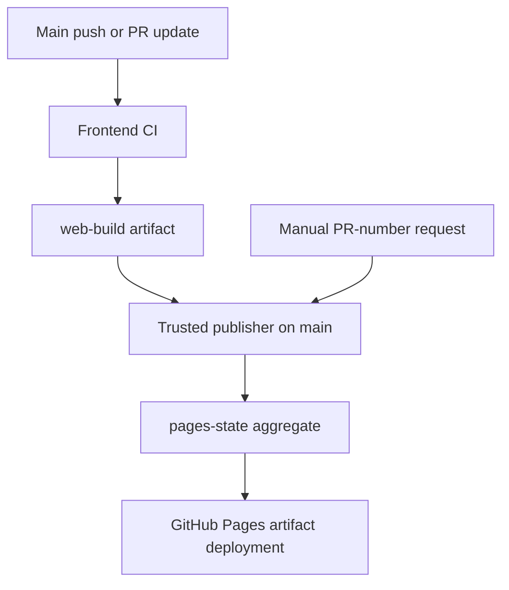

# Deployment architecture

Updated: 1 October 2026. Implemented: #31/#35/#39 in PRs #33/#36/#38/#40. Release promotion: #32. Queue reliability follow-up: #44.

## Trust and artifact flow

CI checks out source with read-only repository permissions, installs pinned dependencies from the lockfile, runs quality/type/tests/build and records source SHA plus CI run ID. It builds the production or preview base path. The publisher checks out main and uses scripts from main; artifact files are copied as static content and are not executed.

## Channels and selection

| Trigger                                        | Result                                                       |
| ---------------------------------------------- | ------------------------------------------------------------ |
| Website-affecting push to main, successful CI  | Publish production root                                      |
| Documentation-only push to main, successful CI | Artifact publish=false; automatic publisher skips deployment |
| Open PR update, successful CI                  | Validate only; no automatic preview update                   |
| Manual Publish website with pr_number          | Select current successful same-repo PR head targeting main   |
| Manual request with blank number               | Republish a successful main artifact                         |
| Closed/merged PR CI marker                     | Retire its preview through the trusted publisher             |

Failed builds do not publish. Stale PR heads, unsupported events and unrelated/fork sources are rejected or skipped. PR artifacts expire after seven days; rerun CI if the current artifact is unavailable.

A manual preview remains on its published commit until manually updated. The footer records PR, source branch and commit for the compiled artifact. Production footer identifies main and its source SHA.

## Aggregate state and paths

pages-state contains generated HTML/assets, preview/pr-N directories and .deployment-state.json. It is not a development branch. The publisher preserves unrelated channels when replacing one channel, then uploads the full combined site through official Pages artifact actions.

Production: /papertrail-reader/. Preview: /papertrail-reader/preview/pr-N/. Build identity: build.json. Aggregate deployed identity: deployment.json. Vite base paths are supplied in CI; hash routing delivered in PR #41 avoids Pages rewrite requirements.

Retirement replaces the PR folder with self-contained styled HTML, preserving a navigable URL and linking ../../ to production. Older retired pages keep their previous design until retirement is rerun. PR builds include preview-closed.html as a clearly labeled design sample.

## Concurrency and recovery

The shared Pages concurrency group permits one running and one pending run. cancel-in-progress:false protects a running publisher but does not guarantee that every pending event survives a burst. Pending production run 36894992262 was cancelled during overlapping events; retrying CI and publisher 36895563022 recovered production.

#44 tracks durable reconciliation of cancelled pending publication events. Until then, after merge verify main CI, the publisher, deployed source SHA and required retirement. Retry a missing/cancelled publisher through the relevant CI job. Older production build run IDs cannot replace newer production state.

## Remaining acceptance

#35 has one remaining live check: documentation-only main publishing must skip. The docs-only audit PR is the controlled test. After its merge, verify green push CI, artifact publish=false, skipped Pages deployment and unchanged production SHA.

#32 implements immutable versioned release URLs, tag/version validation, checksummed artifacts, promotion and rollback. Those capabilities are not implemented. Current rollback is a reviewed revert on main with successful CI/deployment.

## Source and maintenance

See .github/workflows/ci.yml, pages.yml, scripts/build-info.mjs, deploy-policy.mjs and assemble-pages.mjs. Keep this document and deployment-verification.md updated when triggers, artifact trust, paths or recovery rules change.

## Deferred publishing chore — #100

Roadmap 2 #78 owns #100: prevent documentation-only merges from creating Publish website runs. The current workflow starts after successful main CI, then skips deployment for docs-only inputs. Owner explicitly deferred event-level filtering/orchestration until the next roadmap; #100 is not a v1.0.0 blocker. Current workflow triggers remain unchanged during #89.

## #101 deployment evidence

PR #101 merged as 77b8f311a638ba616a19dea0102833167a5453fa. #89 is completed. Main CI 37050685881, issue reconciliation 37050685625 and publisher 37050755788 passed; pages-state metadata identifies production 77b8f31/source CI 37050685881 and preview #101 is retired. This verifies deployment/source metadata, not an additional interactive production audit. Final application/test 48c4295 passed CI 37050069997 (87 unit, 6 pipeline tests) and Browser E2E 37050221708 (81 passed without retries, four intentional duplicate long-document skips). The selected-occurrence screenshot confirms alignment with painted PDF text. Final documentation evidence follows separately because #101 was merged during recording. #79/#1/#80 remain open for final first-release regression and v1.0.0 preparation; version remains 0.1.0. Chore #100 stays deferred under Roadmap 2 #78.
