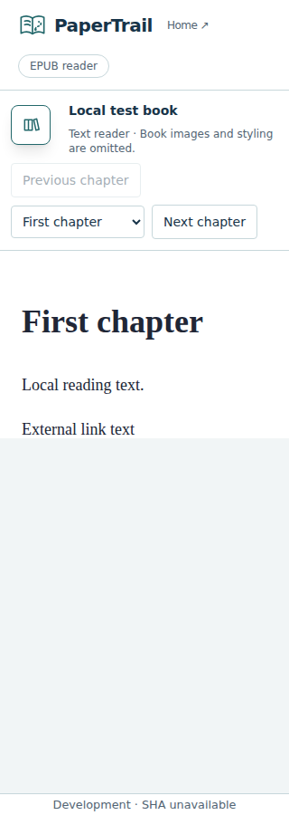
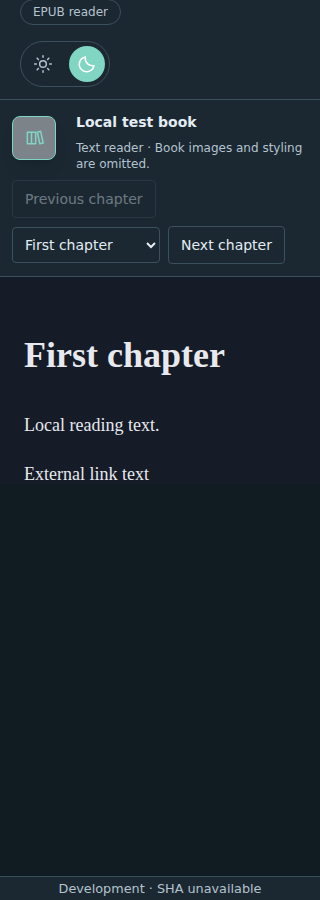
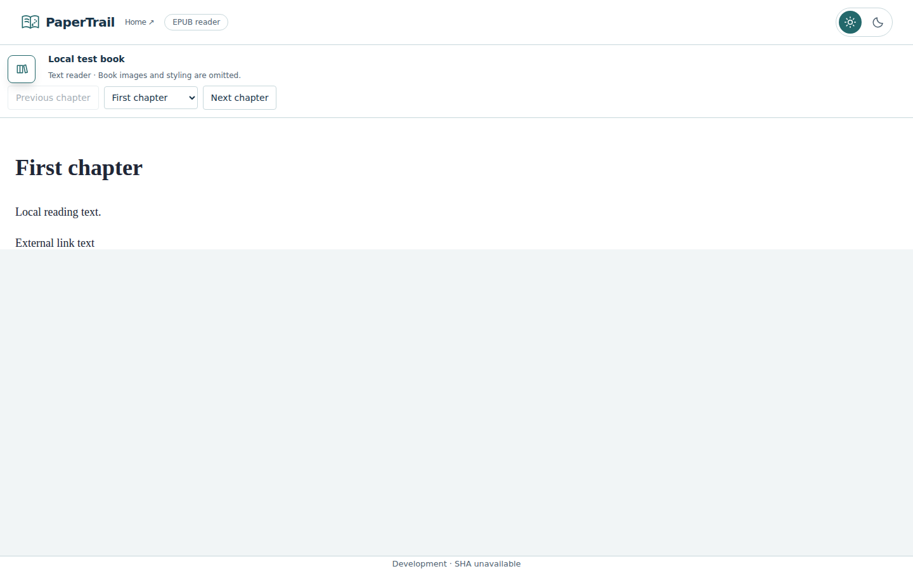
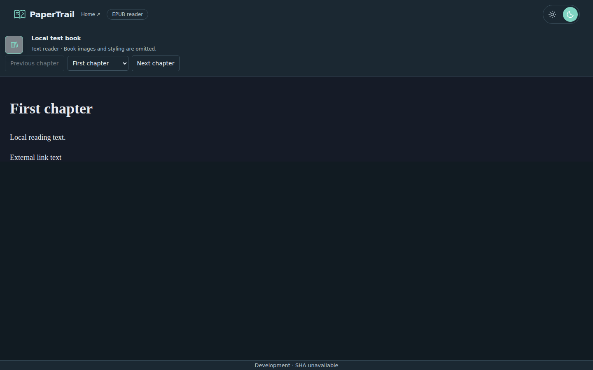

# Verified local EPUB reader — merged #124 / #125

[PR #125](https://github.com/HimanshuHD/papertrail-reader/pull/125) merged as `f9c1703`, completing #124 and implementing #126 resize/overflow correction, #127 fixed side icons and Chapters label, and #128 formatted-by-default rendering with Text-only view. Local lint, formatting, strict types, 172 unit/component tests, 10 pipeline tests and production build pass. Tests cover safe local styles/images, URL disposal, mode/chapter ownership and 150 ms debounce. Browser regressions have been added for authored colors/spacing/images, retained mode anchors and stationary controls.

**Owner merged the delivery; fresh formatted/resize browser evidence remains deferred to #28 release acceptance.** Final source `66ea167` passed [Frontend CI 37190427689](https://github.com/HimanshuHD/papertrail-reader/actions/runs/37190427689). Browser E2E is deferred to reviewed release-to-main opening/readiness under the owner's policy. The runs and screenshots below record the earlier text-only implementation, not the current UI or formatted behavior. Fixed-layout/encrypted books, persistent CFI/identity, authored contents, typography controls, bookmarks and recent EPUB history remain outside this renderer increment.

## #131 contents/typography validation

The current increment adds EPUB 3 nav / EPUB 2 NCX fixtures, validated section anchors in both modes, unsafe/missing/duplicate target filtering, malformed/oversized/deep navigation fallback and optional resource CRC/cancellation coverage. Session/component tests check same-frame fragment navigation, numeric typography/reset, retained text-node offset and stale-source ownership. The suite contains 189 unit/component tests.

Release browser fixtures cover authored contents, fragment scrolling/current marker, font size/line spacing/width/reset, mode changes, mounted frame identity, chapter navigation and narrow/light/dark captures. These fixtures are **not executed evidence** yet; #134/#28 own the final release run. No new screenshot is substituted for the historical captures below. Stable CFI/metadata remains #132/#133; #131 is open until reviewed merge.

## Historical text-only validation

Application/test source `f1f76dae5457e676ec026e6ceeff22c1a5c95b29` passed [Frontend CI 37175969681](https://github.com/HimanshuHD/papertrail-reader/actions/runs/37175969681): lint, formatting, types, 164 unit/component tests, 10 pipeline tests and production build. [Browser E2E 37176268989](https://github.com/HimanshuHD/papertrail-reader/actions/runs/37176268989) passed **107 cases**, eight intentional viewport-specific skips, no failures or retries.

Unit fixtures cover stored/deflated resources, actual decompression limits, declared-size lies, CRC mismatch, hostile XHTML, EPUB 2 doctype compatibility, RTL direction, unsupported publications, cancellation, stale sources, pending archive opening/navigation and engine disposal. Consumed entries are verified before XML parsing; chapters are rebuilt into inert XHTML. The lazy engine receives only generated local paths and text, restrictive CSP and a script-free iframe sandbox. PDF storage, file permissions and EPUB engine ownership remain separate.

Browser fixtures exercise EPUB chapter navigation, light/dark appearance, hostile content with no external requests/script execution, malformed-book recovery and source replacement at 320/375/768/1024/1440px. Existing PDF reading, bookmarks, recent history, workspace restoration and independent scrolling regressions run in the same suite. This is Chromium fixture acceptance; supported-browser and owner preview acceptance remain separate gates.

## Historical inspected screenshots

Light/dark captures at 320px and 1440px were inspected. The Library opener has reserved heading space; title/caption and chapter controls remain readable without horizontal overflow. The complete report is [artifact 11293427377](https://github.com/HimanshuHD/papertrail-reader/actions/runs/37176268989/artifacts/11293427377), retained through 11 October 2026.

An earlier browser run targeted the departing inert sidebar input during source replacement; the final test selects the interactive library picker. The existing short-height scroll test now waits for its recent item before establishing its geometry baseline. Screenshot inspection found and corrected opener/title overlap. The clean run above supersedes that initial result.

## Review gate

#124/#126/#127/#128 are completed by owner merge of #125; their delivery/checklists are reconciled. #12 and EPUB milestone 3 remain open (five open, five closed issues; enhancement work tracked in #131–#134) for remaining EPUB scope. Preparation and Reading continuity milestones are closed. Fresh browser/screenshots gates are explicitly retained in #28 and #12; historical evidence above is not current formatted/resize acceptance.

---

[Previous](recent-library.md) · [Documentation home](../README.md) · [Evidence index](README.md)

## #131 UI refinement in PR #135

Replaces the duplicate Chapters dropdown with Contents alone. The PDF-style utility bar uses shared icon buttons; Contents toggles a right utility panel (docked on wide reader areas, overlay on narrow ones). Typography opens a compact popover with font −/+, segmented spacing/width choices and Reset. Escape/close focus restoration, outside-popover dismissal and reduced-motion/inert transitions are covered by component regressions; mode/source ownership and fixed side chapter controls remain. Later Bookmarks/features extend this utility area under #133. Release browser fixtures use the revised controls; execution remains deferred to #134/#28.

## #131 review observations: loading and controls

Chapter/mode loading is contained in a fixed reading-stage overlay with a 150ms delayed loader; Contents metadata remains visible and stable. Book default shows the measured chapter text size and its numerical duplicate is excluded from font stepping. Width choices use mobile/tablet/desktop-style measures: Narrow at 50% capped to 480px, Medium at 70% capped to 768px, Wide at 90% capped to 1100px. Mobile windows below 640px have no width choices; tablet windows below 1024px omit Wide. Full width remains distinct. Iframe pointer/Escape listeners dismiss Typography and are cleaned up; top utility tooltips stack above the popover. Text-only is an accessible switch, and fixed chapter controls are borderless icons with subtle hover/focus interaction. Unit regressions and deferred browser fixtures track these observations; full visual execution remains the release gate.

## #135 accepted delivery and next increment

Owner verified #131 and its seven review fixes, then merged #135 as `e9d59f4`. Accepted source `4be9aa0` passed Frontend CI 37217580155 (189 unit/component and 10 pipeline tests, lint/format/types/build). The controls described here are delivered; #132 is now active for stable session text/CFI restoration, followed by #133 persistence. Full current-source browser evidence remains deferred to #134/#28 release readiness.

## Stable session reading location — #132

`location.ts` captures a versioned chapter, generated source-node ID, canonical UTF-16 character offset, short text context and viewport pixel offset. Same-mode restoration uses an EPUB CFI when it resolves to the same owned node/character; otherwise it validates the text anchor. These CFIs refer to the sanitized, generated local publication, not the original author's DOM or an interchange identifier. Cross-mode restoration deliberately uses stable source IDs/text, excluding generated image alternate text from character counting. Image-only anchors retain the source element; omitted images land at their retained alternate-text element. Tables and RTL use the same character geometry; unavailable geometry falls back to the visible source element. End-of-chapter anchors pin to the new bottom, and all restored scroll coordinates are clamped with horizontal scrolling cleared. Missing nodes, changed text context and invalid chapter/character values reject restoration.

The engine exposes `location()` and asynchronous `restore(location)`, retaining `position()` for compatibility. Typography, the existing 150ms resize debounce and utility/library width changes preserve the cached visible text point without replacing the mounted chapter. Immediate restoration is followed by two animation-frame corrections for settling layout. Navigation, disposal, newer restoration and pointer/wheel/keyboard input cancel those corrections. The composable owns source generations, `reopen()` across modes and public restoration; stale completions cannot replace a newer source or selection. No document identity, EPUB bytes or reading metadata is persisted in this increment; that remains #133.

Local validation passes 197 unit/component tests and 10 pipeline tests, lint, formatting, strict types and production build. Tests use real EPUB CFIs and cover character-level reflow, mode fallback, invalid anchors, chapter-end/image/RTL handling and stale-operation cancellation. The release browser suite now lists 140 cases, including a long-paragraph character-offset regression across typography, Contents width, window resize and mode changes. These fixtures have not been executed for this increment; representative visual/browser acceptance remains #134/#28 on reviewed release-to-main readiness. Delivery is pending review and owner merge.

## #136 merge reconciliation and active #133

Owner merged #136 as `09610e6` after source `2f99f6b` passed Frontend CI 37223881477 (197 unit/component and 10 pipeline tests, lint/format/types/build). #132 is complete and its active label is removed. #133 now owns saved EPUB progress across reload, document switching and later reselection, plus identity/settings/bookmarks/recent history. Its fresh branch starts from updated main; #134 remains new for final release evidence. EPUB milestone 3 remains open: three open (#12/#133/#134), seven completed. Browser E2E remains deferred to reviewed release-to-main readiness.

## Saved EPUB reading continuity — #133

`epub-reading-storage.ts` uses full-content chunked SHA-256 identity, with 1 MiB reads and the existing 128 MiB EPUB input limit. Hashing owns cancellation. The independent `papertrail-epub-reading` IndexedDB database stores version-1 EPUB records: generated-publication location, typography, view mode and named bookmarks. Content identity survives renames; changed bytes select a separate record. Metadata is projected through validators; invalid locations/settings/bookmarks fall back to defaults, while duplicate identities or unsupported record versions are preserved and read fresh without writes. There is no previous EPUB schema to migrate. PDF records and coordinate semantics are unchanged.

`useEpubContinuity` serializes saves before resolving another book, captures progress on document replacement/unmount and flushes on pagehide/hidden visibility. Scroll and preferences queue a 300ms save. Page-exit writes are best effort; abrupt termination before the browser completes a transaction can lose the last pending movement. Blocked/full storage shows a notice while reading remains available. Restoring a source uses identity before opening with saved settings/location, then validates the chapter against the parsed publication. Session generations prevent stale identity/open results from changing a newer book. Missing/changed anchors are rejected by the engine.

The EPUB Bookmarks utility panel supports save current place, navigation, inline rename and removal. Bookmarks and progress share atomic read/modify/write transactions. Clearing storage cannot cause pending saves/bookmark operations to recreate deleted records; a later explicit reselection starts a new record. Names are rendered as text. There are at most 500 bookmarks per book.

Shared recent history now carries an optional format (legacy entries are PDF), deduplicates by format/content and verifies candidates within the matching format. Only successful opens enter history. EPUB workspace recovery uses explicit active-document state, retained folder permissions and remembered path/metadata/content verification before auto-opening. Without retained access, Resume library or manual reselection is required. Forget library removes cached access/listing; clear/remove recent history removes history only; removing a bookmark removes that bookmark only. Reading metadata survives those actions. Clearing the relevant browser databases removes their metadata; EPUB/PDF bytes are never stored.

Local validation passes 206 unit/component tests, 10 pipeline tests, lint/format/types and production build. New coverage includes metadata validation/version/identity isolation, atomic bookmark/progress saves, rename/reselection, page exit, stale identities/bookmark mutations, storage clearing/failure, component restoration and format-aware recent/workspace recovery. The release browser suite lists 145 cases, including reload/reselection, mode/settings/bookmark recovery and changed-content isolation; those browser cases remain unexecuted for this increment under #134/#28 release-only policy. Delivery awaits ordinary CI, review and owner merge.

## #137 merged; final EPUB acceptance — #134

Owner merged #137 as `d7afbf58cf9448749bbd226018956035c5576076`. Accepted source `ec4f995` passed Frontend CI 37225710749: 206 unit/component and 10 pipeline tests, lint/format/types/build. #133 is completed and its stale active label is removed. #134 now owns final reviewed release-candidate checks and current evidence. EPUB milestone 3 remains open: two open (#12/#134), eight completed. #12 and the milestone remain open until the remaining acceptance is verified. Broader Chrome/Edge/Firefox/Safari capability declarations stay in #28. Earlier pending merge and active-increment checkpoints are historical.
