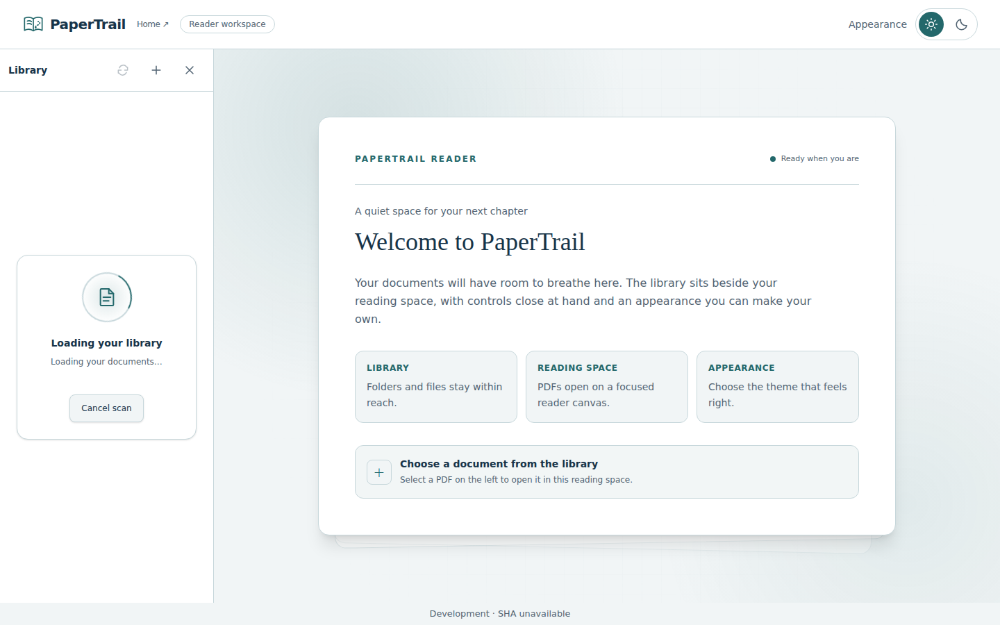
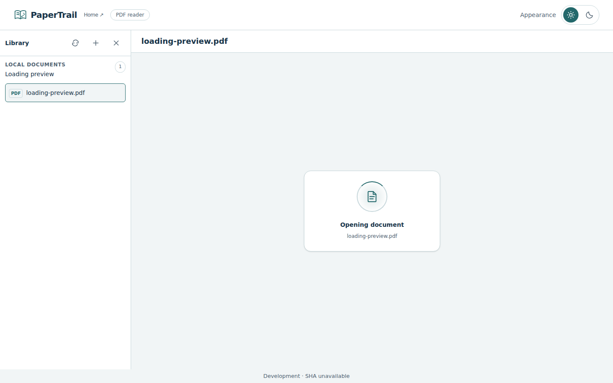

# Loading feedback — #85

Implemented in [PR #97](https://github.com/HimanshuHD/papertrail-reader/pull/97), a child of first-release bug gate #79. Merged as f44d67517ba17053d15e4b420372526a5002a10c; production deployment is verified through workflow and deployment metadata.

## Appearance

Both states use a centered document icon, soft halo and orbit indicator with a concise label. The library adds friendly rotating text and an actionable Cancel scan button while its header remains usable. PDF opening shows the selected filename.

Screenshots below are actual Chromium acceptance captures at 1440 × 900 using a synthetic PDF. Their footer says Development because the browser-test build does not inject deployment metadata; published previews retain the usual PR/SHA footer.

### Library discovery

### PDF opening

## Timing and accessibility

- Successful fast discovery keeps loading visible for three seconds from scan start. Already-slow scans get no additional wait.
- Errors/access problems and cancellation bypass the minimum. New sources/unmount abort old waits; stale controllers cannot publish over a new selection.
- Friendly text rotates every 2.5 seconds and is decorative, so it does not create repeated live announcements. Discovery status remains outside the busy list region.
- PDF opening has no artificial minimum delay. Its busy/status feedback includes the filename.
- Reduced-motion preferences disable animations. Message intervals and pending minimum-duration timers are cleared through their lifecycle/abort owners.

## Validation

Application/test head c51c2eafcf7db59dce1b240d4913b0ba03ffb9ec passed Frontend CI [37040435175](https://github.com/HimanshuHD/papertrail-reader/actions/runs/37040435175): 83 unit tests, six pipeline tests, lint, format, types and build. Browser E2E [37040700001](https://github.com/HimanshuHD/papertrail-reader/actions/runs/37040700001) passed 71 checks without retries; four duplicate long-document checks were intentionally skipped. Centering, message rotation, busy/header controls, reduced motion, completed PDF rendering and existing regressions passed at 320/375/768/1024/1440 widths.

Browser tests control directory-enumeration completion and worker responses to make the transient states observable. These delays exist only in test setup. Screenshots were visually inspected. Earlier formatting/test-setup failures and flaky runs are superseded by this final clean result.

Main CI 37041483607, merge reconciliation 37041484160 and production publisher 37041555992 passed. Production metadata identifies merge f44d675 and source CI 37041483607. #85 is completed. #86/#87 follow together; #89 and final regression remain before release. #79/#1/#80 remain open.

---

[Documentation home](../README.md) · [Next](reader-polish.md)
