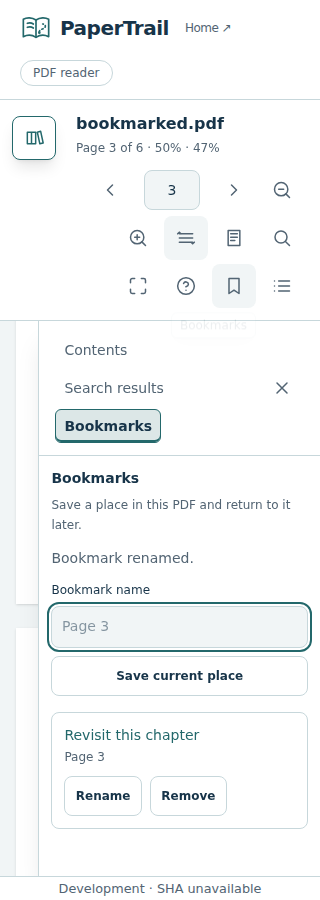
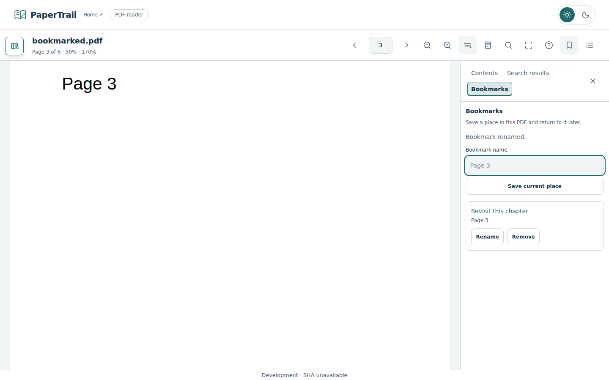

# Named PDF bookmarks — #115

Parent #13; Roadmap 2 owner #78; [PR #120](https://github.com/HimanshuHD/papertrail-reader/pull/120). The owner reviews and merges this increment; #13 stays open for separate format acceptance.

## Behavior

The Bookmarks utility panel saves a named normalized viewport-center anchor, navigates back to that place at the current zoom/fit, and supports inline rename and removal. The existing content fingerprint resolves a stable document UUID, so bookmarks survive reload/reselection and renaming while changed PDFs keep separate records. Workspace restoration retains Bookmarks as the selected panel. No PDF bytes are saved.

Bookmark and reading-position updates share atomic document-store transactions. Existing database version 1 and reading-record versions 1/2 remain compatible. Deleted storage is not resurrected by a stale identity; errors retain the input draft and provide retry/reselection guidance. Unavailable/ambiguous identities disable bookmark edits. Forget library preserves reading metadata, including bookmarks; clearing browser storage removes it.

## Automated evidence

Application/test source `793adcdc2af6f4188b61184a84f823d70981721b` passed [Frontend CI 37140924880](https://github.com/HimanshuHD/papertrail-reader/actions/runs/37140924880) and [Browser E2E 37140988461](https://github.com/HimanshuHD/papertrail-reader/actions/runs/37140988461). Lint, formatting, strict types, 115 unit/component tests, 10 pipeline tests and production build passed. Browser result: **97 passed**, eight intentional viewport-specific skips, no failures or retries.

The bookmark lifecycle passed at 320/375/768/1024/1440px: creation, normalized anchor navigation, rename, reload/reselection, same-content file renaming, changed-content isolation and removal with focus recovery. Desktop additionally clears the reading database and verifies a recoverable failed save, retained draft and no recreated document record. Existing PDF geometry, workspace native-handle recovery and reading-continuity tests remain green. Unit tests cover corrupt metadata, stale loads/mutations, duplicate pending actions, unavailable identity, failed operations/retry, unmount and escaped names. These are Chromium fixtures, not a new OS-picker, other-browser or deployed-preview certification.

The complete report is [artifact 11280138440](https://github.com/HimanshuHD/papertrail-reader/actions/runs/37140988461/artifacts/11280138440), retained through 10 October 2026. The final documentation revision changes only evidence/trackers/images; the application/test source above remains the accepted browser source.

## Inspected browser captures

These are real light-theme Chromium captures with a synthetic six-page PDF. The mobile panel overlays the reading space; desktop keeps it beside the document. Names, page context, editable labels, action buttons and focus outlines are visible. Toolbar and utility modes wrap at narrow widths. Development footer metadata is expected for this browser-test build. Screenshots were visually inspected; this is not a pixel-baseline test or owner preview acceptance.

### 320px

### 1440px

## Review gate

PR #120 was owner-validated and merged as `0b2b5c19268071e49e3c6a2cb70cc06493ac3986`; #115 is completed. Final head Frontend CI 37141468399 passed. No additional preview audit is claimed. Reading continuity milestone 2 and parent #13/#78 remain open for unfinished scope.

---

[Previous](search-highlighting.md) · [Documentation home](../README.md)

## Bookmark merge and next increment — 4 October 2026

#120 merged as `0b2b5c1`; owner confirmed validation. #115 is completed and its active status label is removed. PDF increments #114/#117/#118/#115 are completed; #13 stays open only for separate format acceptance after #12. Preparation milestone 1 is confirmed closed through #100’s embedded milestone metadata. Reading continuity milestone 2 stays open for #14 and unfinished format scope. Next branch: `feat/14-recent-library-search`, from reconciled main. Prior pending-review/milestone-closure statements are historical and superseded.
