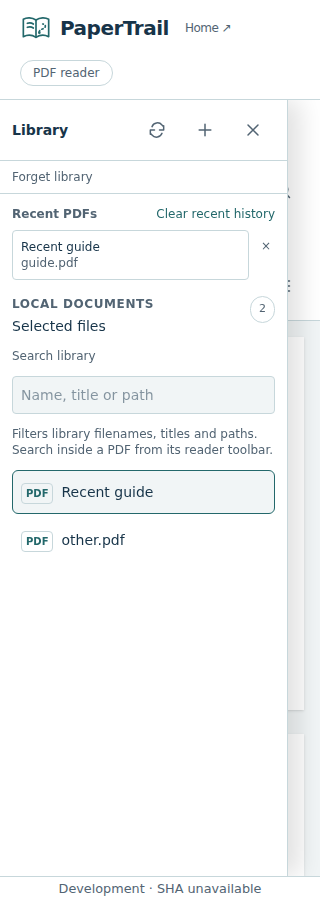
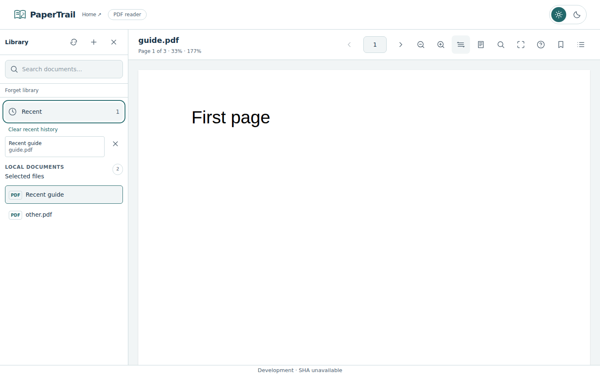

# Recent PDFs and library search — #14

[PR #121](https://github.com/HimanshuHD/papertrail-reader/pull/121) adds library filtering separately from PDF text search and metadata-only recent PDF history. At most 20 content identities are retained. No file bytes or extra handles are stored. Clearing history preserves reading positions/bookmarks; forgetting workspace access preserves history. EPUB listing filtering works; EPUB reading history follows #12.

## Validation

Application/test source `f6d63492aea30011a6008fd4a888eb203a62040b` passed [Frontend CI 37145713723](https://github.com/HimanshuHD/papertrail-reader/actions/runs/37145713723): lint, formatting, strict types, 121 unit/component tests, 10 pipeline tests and production build. [Browser E2E 37145782531](https://github.com/HimanshuHD/papertrail-reader/actions/runs/37145782531) passed **102 cases**, eight intentional viewport-specific skips, no failures or retries. All five recent-library lifecycle cases and existing PDF regressions passed.

Unit coverage includes corrupt/bounded/deduplicated recent metadata, literal Unicode search across title/name/path, fingerprint-verified renamed/changed/missing files, aborted matching, serial writes, storage failures, unmount and independent history-removal events. Browser lifecycle runs at 320/375/768/1024/1440px: search/clear, persistence after reload, unavailable-file guidance, renamed-content reopening, history clearing and preserved reading metadata. Existing PDF reading/bookmark/workspace/geometry regressions run in the same suite.

The first browser run 37145379317 passed 97 cases and failed five existing continuity cases because their broad filename locator matched the new recent buttons too. The corrected test selects the exact library PDF button and retains the original position/zoom/anchor assertions. This was a test selector ambiguity, not a changed file-identity rule.

## Inspected screenshots

The 320px and 1440px light-theme browser captures were inspected: recent actions and library filter remain readable within the scrollable sidebar; mobile overlay and desktop split pane fit the viewport. The complete report is [artifact 11281304689](https://github.com/HimanshuHD/papertrail-reader/actions/runs/37145782531/artifacts/11281304689), retained through 10 October 2026.

Final evidence/trackers/image edits change documentation only; the accepted application/test source above remains unchanged.

## Review gate

Owner preview/review and merge remain pending; #14 remains open. Evidence covers Chromium fixtures, not a new OS picker, other-browser or deployed-preview certification. Preparation milestone 1 is verified closed; #120 and #115 are completed. #13/milestone 2 remain open for unfinished format scope. Next planned format increment is #12 after #14 acceptance.

---

[Previous](pdf-bookmarks.md) · [Documentation home](../README.md) · [Evidence index](README.md)

## Owner scope and sidebar reconciliation — 4 October 2026

#13 is closed completed: PDF identity, positions, view/anchor restoration and bookmarks are accepted in merged #116/#119/#120. EPUB/CFI and format-specific persistence remain owned by #12 in EPUB milestone 3; they do not block #13. Earlier notes retaining #13 for EPUB are historical and superseded. Reading continuity milestone 2 stays open for #14 only.

#14 owner feedback remains in PR #121: Recent is a collapsible component with a leading clock icon and trailing count; search sits immediately below the Library header with exact `Search documents...` placeholder and a search icon. Visible search label/help and empty recent-history copy are removed; accessible naming/live result count and recovery actions remain. Full validation is running; do not start the next item before owner acceptance.
