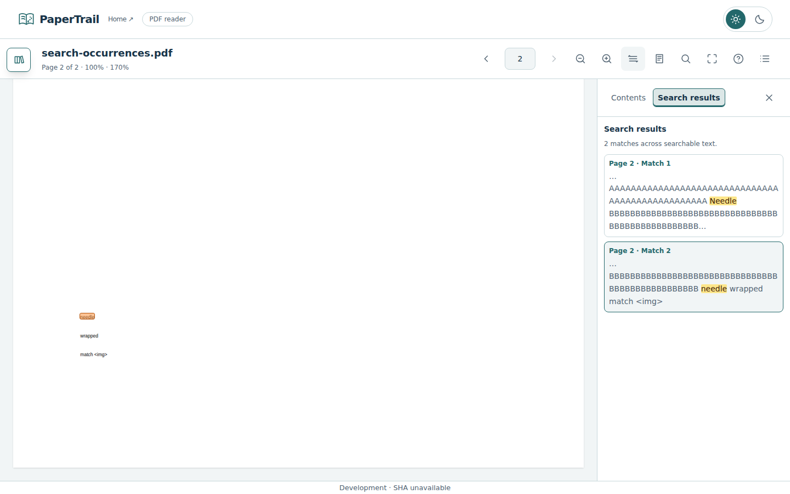

# Search excerpts and selected PDF matches — #89

Parent #79; first-release roadmap #1. PR #101 stays within the browser PDF reader. Version remains 0.1.0; Roadmap 2 chore #100 is deferred under #78.

## Behavior and architecture

Search results wrap within the utility panel, including unbroken tokens. Each excerpt retains the complete matched term and at most 50 Unicode characters on either side, with ellipses for omitted context. Vue text nodes and mark elements escape document content; PDF text is never parsed as HTML. Marks use amber backgrounds and dark ink in both themes. Repeated matches have separate occurrence numbers and selected result buttons expose aria-pressed.

The session and page view share canonical whitespace/literal case-insensitive matching and source-offset mapping. A result selects its exact occurrence. Native DOM Range rectangles create pointer-transparent overlays without replacing PDF.js glyph spans. Selection scrolls only the reader pane, once per explicit result click. Overlays rebuild after zoom/fit/render and clear on query/document edits or bitmap release. Image-only PDFs retain the existing no-searchable-text feedback; OCR is outside this release.

PDF.js text layout requires its current font-height/scaling CSS, rounding units and page rotation metadata. The view supplies the glyph CSS contract and preserves metadata when swapping detached renders into the page. Canvas coordinates provide the overlay origin, keeping text selection and painted content coherent.

## Validation

Application/test commit 48c4295d4c631557ee6a81da60653ad3f167358e passed Frontend CI [37050069997](https://github.com/HimanshuHD/papertrail-reader/actions/runs/37050069997): 87 unit tests, six pipeline tests, lint, formatting, types and production build. Explicit Browser E2E [37050221708](https://github.com/HimanshuHD/papertrail-reader/actions/runs/37050221708) passed 81 Chromium checks without retries in 3.2 minutes; four duplicate long-document checks were intentionally skipped. Search checks passed at 320/375/768/1024/1440 widths: bounded context, wrapping, safe marks, exact occurrence visibility on selection, canvas/DOM alignment through scrolling and zoom/fit, stale-query clearing and multiline ranges. Existing PDF geometry/large-document regressions also passed. The selected-occurrence screenshot was inspected for actual painted-text alignment. This records Chromium acceptance, not additional browser/OS or production-preview validation. Artifact 11246570841 preserves the complete browser report for seven days; selected captures are committed below.

The first implementation passed DOM-only alignment assertions, but visual inspection found that both the text layer and overlays were displaced from the painted canvas. The correction restores the PDF.js stylesheet contract and adds an independent assertion against known fixture PDF coordinates and actual canvas ink. Those initial screenshots are superseded by the captures below.

## Browser captures

These are actual Chromium acceptance captures using a synthetic two-page searchable PDF; they are not deployed preview captures. The fixture includes repeated case-insensitive matches, long tokens, a term spanning separate text lines and literal HTML-like text. Development footer metadata is expected for the browser-test build. The selected occurrence is orange; other matches are amber.

### Selected occurrence in light theme

Dark-theme mark contrast and wrapped multi-line occurrence highlights are covered by the browser assertions. Their capture occurred during popover exit motion and is retained only in the full workflow artifact, rather than as a settled documentation screenshot.

## Merge and release sequence

PR #101 merged as 77b8f311a638ba616a19dea0102833167a5453fa. #89 is completed. Main CI 37050685881, issue reconciliation 37050685625 and publisher 37050755788 passed; pages-state metadata identifies production 77b8f31/source CI 37050685881 and preview #101 is retired. This verifies deployment/source metadata, not an additional interactive production audit. Final application/test 48c4295 passed CI 37050069997 (87 unit, 6 pipeline tests) and Browser E2E 37050221708 (81 passed without retries, four intentional duplicate long-document skips). The selected-occurrence screenshot confirms alignment with painted PDF text. Final documentation evidence follows separately because #101 was merged during recording. #79/#1/#80 remain open for final first-release regression and v1.0.0 preparation; version remains 0.1.0. Chore #100 stays deferred under Roadmap 2 #78.

---

[Previous](reader-polish.md) · [Documentation home](../README.md)
