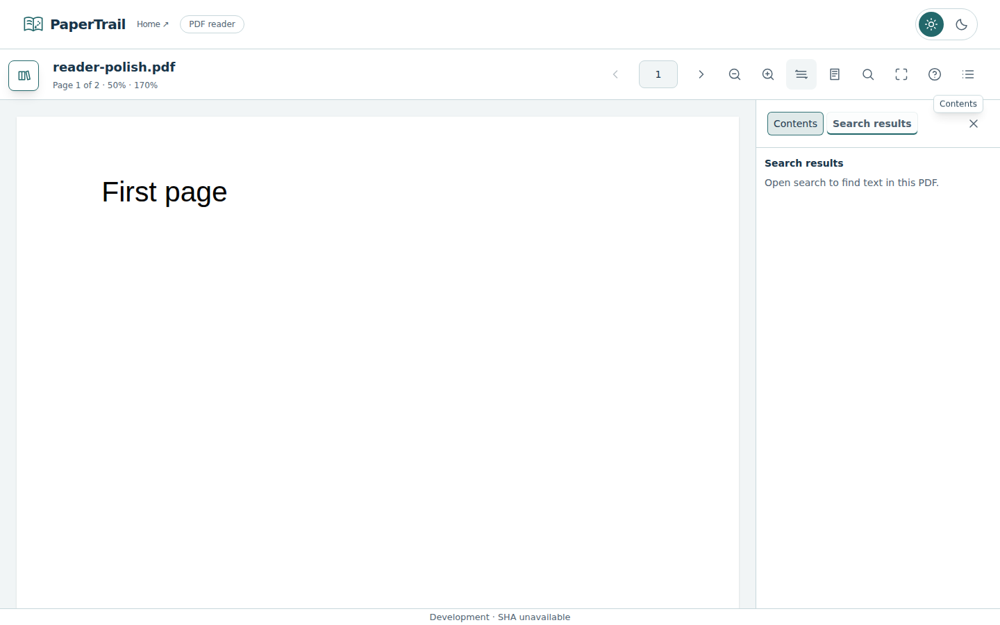
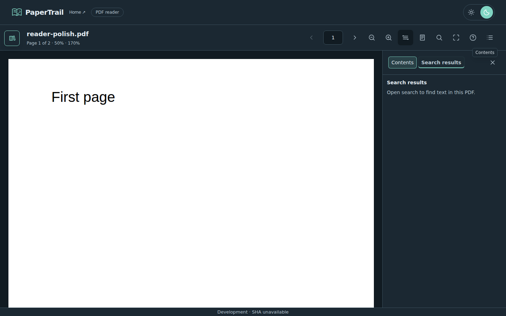
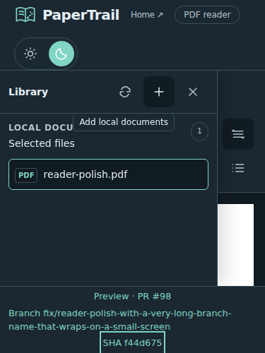

# Reader polish — #86 and #87

Parent #79; first release roadmap #1. This combined increment preserves #85 screenshots and merge evidence alongside control/footer refinements. #89 search excerpts/highlighting and final regression remain before #80. Version remains 0.1.0.

## Controls and motion

The page-number field adds 8px inline margins beyond the toolbar gap, clearing its 2px outline with 4px offset. The main-header Appearance label is removed; Dark mode keeps its accessible name and pressed state. Utility mode buttons expose aria-pressed and show the selected state through a tinted background, brand border/underline and bold ink text in both themes.

Library and utility panels enter and leave over 320ms with cubic-bezier(0.22, 1, 0.36, 1). Search/help and source menus use 240ms with the same easing; icon tooltips use 180ms. Actions update immediately without artificial waits. Leaving surfaces are inert and aria-hidden, and entering surfaces restore both attributes for interrupted/reversed transitions via the shared transition-surface lifecycle helper. A departing utility panel is positioned out of flex layout. Its Close/Escape action restores focus to Contents; existing search/help, library and source-menu focus/dismissal behavior remains. Reduced-motion preferences remove transitions.

## Footer

The footer uses 2px vertical and 12px horizontal padding, smaller row gaps, a pane-colored background and divider, muted text and brand links. Links retain a 24px minimum target height. Version/environment/PR/branch/SHA links remain unchanged. Long branch names wrap; the app footer's existing bounded independent overflow remains for very short windows.

## Validation

Application/test commit 14cd5058609c15ee351a88f6161705f84107c23f passed Frontend CI [37044894101](https://github.com/HimanshuHD/papertrail-reader/actions/runs/37044894101): 83 unit tests, six pipeline tests, lint, format, types and production build. Browser E2E [37045007961](https://github.com/HimanshuHD/papertrail-reader/actions/runs/37045007961) passed 76 Chromium checks without retries in 2.8 minutes; four duplicate long-document checks were intentionally skipped. All five new interaction/footer checks passed at 320/375/768/1024/1440 widths. Earlier type/lint/selector/scoped-fixture failures are superseded by this final clean result. PR #98 is merged; #86/#87 are completed. Browser checks cover active states in both themes, input focus clearance, enter/exit motion, reduced motion, focus restoration, narrow widths and 500px height. The short-height footer stress capture injects representative link text into the actual footer CSS because the CI build omits deployment metadata; unit tests verify the real metadata template. It is a synthetic layout test, not a deployed preview capture.

The earlier centered loading screenshots and final #97 validation are preserved in [loading-feedback.md](loading-feedback.md).

## Browser captures

Actual acceptance captures using a synthetic two-page PDF. Desktop footers say Development because Browser E2E omits deployment metadata; publication embeds normal PR/SHA/branch identifiers. The narrow 375 × 500 capture uses synthetic preview links to stress long branch wrapping under the real scoped footer styles. It is not a deployed preview screenshot.

### Light theme — Search results selected

### Dark theme — Search results selected

### Narrow footer stress fixture

Owner published the preview manually and merged #98. No automatic PR publisher ran for development commits. Main publication and preview retirement passed after merge. #89 is next, then final regression and #80; no release/version change is included.

## Current reconciliation — merged #98

PR #98 merged as 376323ce2171eb17f45ecded2f266cf431baa07e. #86/#87 are completed. Main CI 37045669575, issue reconciliation 37045671003 and publisher 37045732211 passed; pages-state metadata identifies production 376323c/source CI 37045669575 and preview #98 is retired. This verifies pipeline/source metadata, not a new interactive production audit. Final application/browser evidence is 14cd505 / Frontend CI 37044894101 / Browser E2E 37045007961 (83 unit, 6 pipeline, 76 browser checks without retries; four intentional duplicate long-document skips). Final screenshots and current documentation are preserved in a docs-only follow-up because #98 was merged during documentation recording. This supersedes historical pending preview/merge statements above. Next #89, then final regression/release #80. #79/#1 remain open; version remains 0.1.0.
