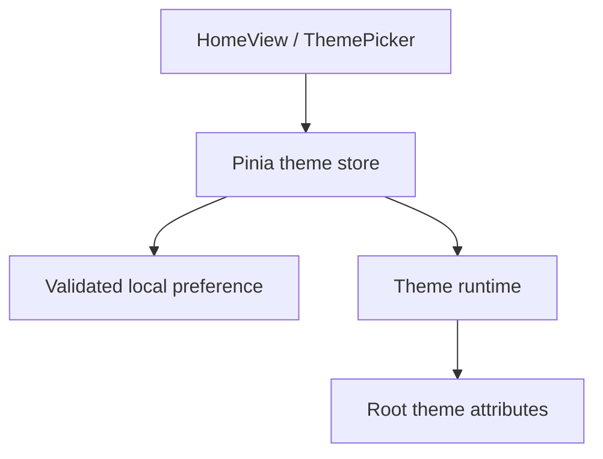

# Vue application architecture

Updated: 2 October 2026. Owner: #1. Foundation: #3/#22. Completed increment: #6 / merged PR #41.

## Implementation status after PR #55

| Layer           | Implemented on main                                            | Remaining owner                        |
| --------------- | -------------------------------------------------------------- | -------------------------------------- |
| App/root        | Shared footer, HomeView and ReaderView through RouterView      | Browser library tree #25                |
| Styling         | Tailwind semantic Light/Dark tokens and responsive shell       | Product-specific reader states         |
| State           | Theme plus source selection and discovery progress/results      | Library tree state #25; metadata #13   |
| Routing         | Hash home/app/fallback with Vite BASE_URL                      | Future document routes as needed       |
| Reader contract | Typed PDF page/zoom and EPUB CFI/font contracts                | Engines #10/#12                        |
| File access     | Source selection #8 plus discovery/indexing #24                | Tree/refresh UI #25                    |
| Persistence     | Light/Dark choice in localStorage; no reading-data persistence | #13                                    |

#6/#46/#42/#49/#43/#8/#24 are merged. Shell metadata is clearly labeled demonstration content. Browser source selection and incremental discovery are implemented; #25 owns visible tree/list plus refresh/reselection UI, while reader implementation remains separate.

## Implemented foundation flow (#6)

| Module                            | Responsibility                                     | Boundary                                           |
| --------------------------------- | -------------------------------------------------- | -------------------------------------------------- |
| src/App.vue                       | Root view composition and footer                   | No file enumeration or reader engines              |
| src/views/HomeView.vue            | Foundation content                                 | Calls UI controls, identifies unavailable features |
| src/components/ThemePicker.vue    | Labeled System/Light/Dark selection                | Calls the theme action                             |
| src/stores/theme.ts               | Preference, OS appearance and resolved theme       | Does not manipulate reader content                 |
| src/services/theme-preferences.ts | Validate/read/write papertrail.theme.v1            | Storage failure returns a session-safe fallback    |
| src/services/theme-runtime.ts     | Apply theme, listen for OS changes, return cleanup | Started before mount, disposed during HMR          |
| src/router/index.ts               | Hash routes under import.meta.env.BASE_URL         | No host rewrite dependency                         |
| src/types/reader.ts               | Format-specific adapter types                      | Not an engine implementation                       |

Light/Dark are explicit choices; System mode is removed in #46. Missing, invalid and legacy System storage values fall back to Light. Blocked storage does not stop theme changes. Theme choice is intentionally shared by production and previews on the same origin; future reading metadata must be namespaced by base path.

## UI architecture work for #7

- #42: component boundaries, responsive sidebar/workspace/toolbar and clearly labeled demonstration content.
- #43: keyboard/focus behavior and empty/loading/error/demo state presentation. ReaderView owns transient shell presentation and announcements; ShellStatus renders explicit view-only states. Escape from the library closes it and restores focus to the toggle. These states do not model file selection, indexing or reader services.
- #37: real-browser E2E infrastructure and acceptance execution, rather than duplicating it in both UI children.

#7 and #37 are completed after explicit browser acceptance in run 36924070741. Each child PR must record component ownership, props/events, state transitions, accessibility evidence and the related docs changes.

Components should render state through explicit props and emit user intent. Application services or Pinia actions own workflows. Reader/library services own document work. Do not let the sidebar access the filesystem directly, or couple the root component to PDF.js/epub.js.

## Planned provider and reader layers

Browser source selection starts in #8 with `src/features/library/browser-selection.ts`, which feature-detects the native directory picker, normalizes picker failures and preserves raw directory handles or selected `File` objects. `LibrarySourcePicker.vue` owns user-triggered controls and browser fallbacks. #24 adds `src/features/library/discovery.ts`: it consumes that selection, recursively traverses approved directory handles or snapshot `File[]`, filters PDF/EPUB case-insensitively, preserves relative paths, yields during large scans, supports `AbortSignal`, and returns partial documents plus recoverable per-path problems. `ReaderView` owns the current discovery controller/progress/result and passes only presentation data to the sidebar. Hierarchy rendering, refresh and reselection UI remain #25.

PDF and EPUB engines will share lifecycle/navigation/progress/contents boundaries but expose different controls. PDF uses fixed pages and zoom/fit; EPUB uses CFI locations and typography. Reader adapters must release worker/render tasks and Blob URLs when switching. IndexedDB migrations, identity reconciliation and stored positions belong to #13.

## Documentation practice

Update this document and architecture.md when ownership or public contracts change. Update tests and issue/PR references together. Record accepted architecture decisions separately from planned work; preserve the roadmap PDF as a planning snapshot.

## Appearance refinement (#46)

The sun/moon button uses native button keyboard activation, aria-pressed for Dark mode, a visible focus ring and decorative SVG icons. Pinia contains Light/Dark only; theme-runtime watches explicit state with no matchMedia listener. Existing Light/Dark preferences persist; legacy System resolves to Light. This supersedes the original #6 System behavior.

## Reader shell and entry (#42/#49)

HomeView remains the foundation landing page, with Go to app routing to ReaderView at /app. ReaderView owns sample selection and sidebar visibility; layout/library/viewer children use explicit props/events and slots. See [shell-layout.md](shell-layout.md) for module ownership and responsive rules. #43 completed the accessibility/status increment in merged PR #53; #37 completed explicit browser acceptance after PR #55. Status state is view-only: future library/reader services expose workflow state through their own contracts rather than mutating shell presentation directly.

## Browser discovery increment (#24)

`discoverDocuments` is UI-neutral. Its normalized `DiscoveredDocument` identity is session-local only; persistent document identity remains #13. Individual-file fallback stays flat even when browser `File` objects originated elsewhere. Directory-input snapshots may use `webkitRelativePath`; approved directory handles are walked recursively from their granted root without exposing or inventing absolute paths.

Discovery cancellation stops PaperTrail's application-level traversal and returns partial results. It does not claim to cancel picker/OS enumeration that already occurred before files reached the app. Read/enumeration failures are recorded per path so usable documents survive isolated access failures. #25 consumes these normalized results to build the visible library tree.
