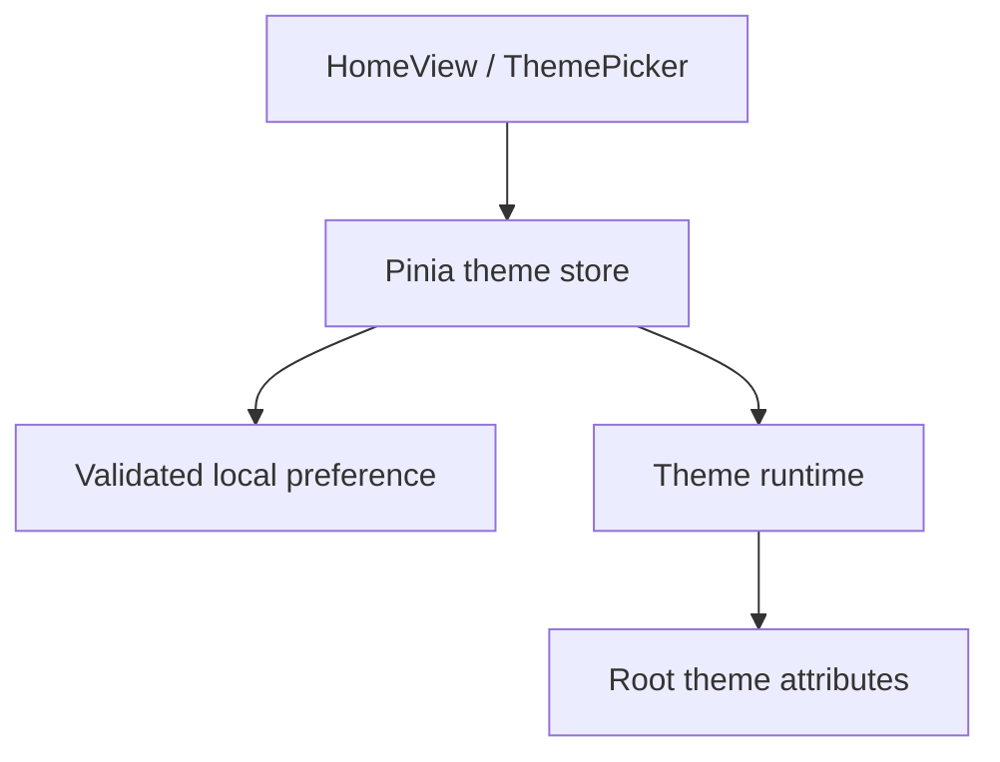

# Vue application architecture

Updated: 1 October 2026. Owner: #1. Foundation: #3/#22. Pending increment: #6 / PR #41.

## Implementation status

| Layer           | Current main                            | PR #41 under review                                | Planned owner        |
| --------------- | --------------------------------------- | -------------------------------------------------- | -------------------- |
| App/root        | Foundation screen and deployment footer | Root composition, HomeView and RouterView          | #6                   |
| Styling         | Foundation CSS and linked footer        | Tailwind semantic light/dark tokens                | #6                   |
| State           | No reader/library state yet             | Pinia theme preference and resolved appearance     | #6; later #7/#9      |
| Routing         | Static foundation page                  | Hash routing with Vite BASE_URL; home and fallback | #6                   |
| Reader contract | Architecture plan                       | Typed PDF page/zoom and EPUB CFI/font contracts    | #6; engines #10/#12  |
| File access     | Not implemented                         | Not implemented                                    | #8/#9                |
| Persistence     | No reading-data persistence             | Theme choice only, localStorage                    | Reading metadata #13 |

PR #41 is not merged at this audit. Its source files and tests are reviewable on feat/6-theme-state-foundation. Do not treat this document as a claim that folder selection or document reading works.

## Proposed foundation flow in PR #41

| Module                            | Responsibility                                     | Boundary                                           |
| --------------------------------- | -------------------------------------------------- | -------------------------------------------------- |
| src/App.vue                       | Root view composition and footer                   | No file enumeration or reader engines              |
| src/views/HomeView.vue            | Foundation content                                 | Calls UI controls, identifies unavailable features |
| src/components/ThemePicker.vue    | Labeled System/Light/Dark selection                | Calls the theme action                             |
| src/stores/theme.ts               | Preference, OS appearance and resolved theme       | Does not manipulate reader content                 |
| src/services/theme-preferences.ts | Validate/read/write papertrail.theme.v1            | Storage failure returns a session-safe fallback    |
| src/services/theme-runtime.ts     | Apply theme, listen for OS changes, return cleanup | Started before mount, disposed during HMR          |
| src/router/index.ts               | Hash routes under import.meta.env.BASE_URL         | No host rewrite dependency                         |
| src/types/reader.ts               | Format-specific adapter types                      | Not an engine implementation                       |

Explicit Light/Dark overrides OS appearance; System follows OS changes. Invalid storage values fall back to System. Blocked storage does not stop theme changes. Theme choice is intentionally shared by production and previews on the same origin; future reading metadata must be namespaced by base path.

## UI architecture work for #7

- #42: component boundaries, responsive sidebar/workspace/toolbar and clearly labeled demonstration content.
- #43: keyboard/focus behavior and empty/loading/error state presentation.
- #37: real-browser E2E infrastructure and acceptance execution, rather than duplicating it in both UI children.

#7 implementation is paused during owner validation of PR #41. Each child PR must record component ownership, props/events, state transitions, accessibility evidence and the related docs changes.

Components should render state through explicit props and emit user intent. Application services or Pinia actions own workflows. Reader/library services own document work. Do not let the sidebar access the filesystem directly, or couple the root component to PDF.js/epub.js.

## Planned provider and reader layers

LibraryProvider will isolate user-triggered selection, capabilities, indexing, access, refresh and reselection. Browser handles are optional; directory/file inputs remain fallbacks. No provider implementation is claimed yet.

PDF and EPUB engines will share lifecycle/navigation/progress/contents boundaries but expose different controls. PDF uses fixed pages and zoom/fit; EPUB uses CFI locations and typography. Reader adapters must release worker/render tasks and Blob URLs when switching. IndexedDB migrations, identity reconciliation and stored positions belong to #13.

## Documentation practice

Update this document and architecture.md when ownership or public contracts change. Update tests and issue/PR references together. Record accepted architecture decisions separately from planned work; preserve the roadmap PDF as a planning snapshot.
