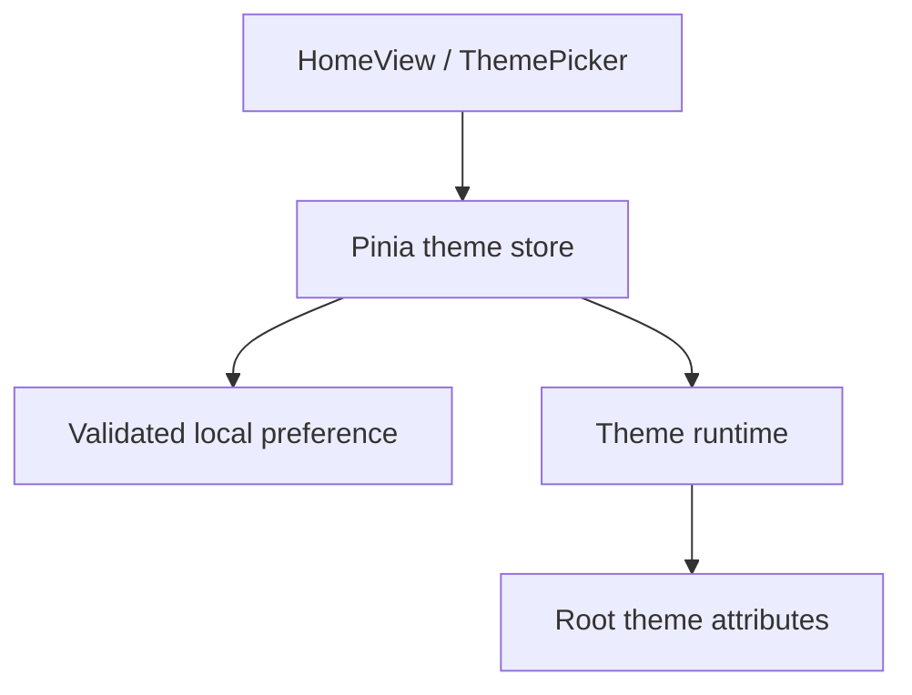

# Vue application architecture

Updated: 2 October 2026. Owner: #1. Foundation: #3/#22. Completed increment: #6 / merged PR #41.

## Implementation status after PR #60

| Layer           | Implemented on main                                            | Remaining owner                     |
| --------------- | -------------------------------------------------------------- | ----------------------------------- |
| App/root        | Shared footer, HomeView and ReaderView through RouterView      | PDF UI follow-ups #62–#64           |
| Styling         | Tailwind semantic Light/Dark tokens and responsive shell       | Product-specific reader states      |
| State           | Theme, library state and active PDF reader state               | PDF UI state #64; PDF metadata #13  |
| Routing         | Hash home/app/fallback with Vite BASE_URL                      | Future document routes as needed    |
| Reader contract | PDF.js core reader #10 plus EPUB CFI/font contracts            | PDF UI follow-ups #62–#64; EPUB #12 |
| File access     | Source selection #8, discovery #24 and tree/refresh #25        | Persistent identity #13             |
| Persistence     | Light/Dark choice in localStorage; no reading-data persistence | #13                                 |

#6/#46/#42/#49/#43/#8/#24/#25 are merged. M2 browser selection, discovery, hierarchy and refresh/reselection are complete. Local-document selection now hands a `File` toward the reader boundary; PDF.js core #10 and utilities #11 are implemented; EPUB #12 is deferred to the next version.

## Implemented foundation flow (#6)

| Module                            | Responsibility                                     | Boundary                                           |
| --------------------------------- | -------------------------------------------------- | -------------------------------------------------- |
| src/App.vue                       | Root view composition and footer                   | No file enumeration or reader engines              |
| src/views/HomeView.vue            | Foundation content                                 | Calls UI controls, identifies unavailable features |
| src/components/ThemePicker.vue    | Labeled System/Light/Dark selection                | Calls the theme action                             |
| src/stores/theme.ts               | Preference, OS appearance and resolved theme       | Does not manipulate reader content                 |
| src/services/theme-preferences.ts | Validate/read/write papertrail.theme.v1            | Storage failure returns a session-safe fallback    |
| src/services/theme-runtime.ts     | Apply theme, listen for OS changes, return cleanup | Started before mount, disposed during HMR          |
| src/router/index.ts               | Hash routes under import.meta.env.BASE_URL         | No host rewrite dependency                         |
| src/types/reader.ts               | Format-specific adapter types                      | Not an engine implementation                       |

Light/Dark are explicit choices; System mode is removed in #46. Missing, invalid and legacy System storage values fall back to Light. Blocked storage does not stop theme changes. Theme choice is intentionally shared by production and previews on the same origin; future reading metadata must be namespaced by base path.

## UI architecture work for #7

- #42: component boundaries, responsive sidebar/workspace/toolbar and clearly labeled demonstration content.
- #43: keyboard/focus behavior and empty/loading/error/demo state presentation. ReaderView owns transient shell presentation and announcements; ShellStatus renders explicit view-only states. Escape from the library closes it and restores focus to the toggle. These states do not model file selection, indexing or reader services.
- #37: real-browser E2E infrastructure and acceptance execution, rather than duplicating it in both UI children.

#7 and #37 are completed after explicit browser acceptance in run 36924070741. Each child PR must record component ownership, props/events, state transitions, accessibility evidence and the related docs changes.

Components should render state through explicit props and emit user intent. Application services or Pinia actions own workflows. Reader/library services own document work. Do not let the sidebar access the filesystem directly, or couple the root component to PDF.js/epub.js.

## Planned provider and reader layers

Browser source selection starts in #8 with `src/features/library/browser-selection.ts`, which feature-detects the native directory picker, normalizes picker failures and preserves raw directory handles or selected `File` objects. `LibrarySourcePicker.vue` owns user-triggered controls and browser fallbacks. #24 adds `src/features/library/discovery.ts`: it consumes that selection, recursively traverses approved directory handles or snapshot `File[]`, filters PDF/EPUB case-insensitively, preserves relative paths, yields during large scans, supports `AbortSignal`, and returns partial documents plus recoverable per-path problems. `ReaderView` owns the current discovery controller/progress/result and passes only presentation data to the sidebar. Hierarchy rendering, refresh and reselection UI completed in #25 / merged PR #57.

PDF and EPUB engines will share lifecycle/navigation/progress/contents boundaries but expose different controls. PDF uses fixed pages and zoom/fit; EPUB uses CFI locations and typography. Reader adapters must release worker/render tasks and Blob URLs when switching. IndexedDB migrations, identity reconciliation and stored positions belong to #13.

## Documentation practice

Update this document and architecture.md when ownership or public contracts change. Update tests and issue/PR references together. Record accepted architecture decisions separately from planned work; preserve the roadmap PDF as a planning snapshot.

## Appearance refinement (#46)

The sun/moon button uses native button keyboard activation, aria-pressed for Dark mode, a visible focus ring and decorative SVG icons. Pinia contains Light/Dark only; theme-runtime watches explicit state with no matchMedia listener. Existing Light/Dark preferences persist; legacy System resolves to Light. This supersedes the original #6 System behavior.

## Reader shell and entry (#42/#49)

HomeView remains the foundation landing page, with Go to app routing to ReaderView at /app. ReaderView owns sample selection and sidebar visibility; layout/library/viewer children use explicit props/events and slots. See [shell-layout.md](shell-layout.md) for module ownership and responsive rules. #43 completed the accessibility/status increment in merged PR #53; #37 completed explicit browser acceptance after PR #55. Status state is view-only: future library/reader services expose workflow state through their own contracts rather than mutating shell presentation directly.

## Browser discovery increment (#24)

`discoverDocuments` is UI-neutral. Its normalized `DiscoveredDocument` identity is session-local only; persistent document identity remains #13. Individual-file fallback stays flat even when browser `File` objects originated elsewhere. Directory-input snapshots may use `webkitRelativePath`; approved directory handles are walked recursively from their granted root without exposing or inventing absolute paths.

Discovery cancellation stops PaperTrail's application-level traversal and returns partial results. It does not claim to cancel picker/OS enumeration that already occurred before files reached the app. Read/enumeration failures are recorded per path so usable documents survive isolated access failures. #25 consumes these normalized results to build the visible library tree.

## Browser library tree increment (#25)

`src/features/library/library-tree.ts` reconstructs presentation hierarchy only from normalized `DiscoveredDocument.parentPath`; it never invents absolute paths. Directory-backed and directory-input selections can render nested folders, while individual-file fallback remains flat. `LibraryTree.vue` and recursive `LibraryTreeNode.vue` own presentation/expansion; `ReaderView` owns selected local document identity and restores it after a live-handle refresh by exact session ID or a unique relative-path match.

Refresh semantics follow the browser source boundary. A live `FileSystemDirectoryHandle` can be rescanned in the current session. Directory-input and individual-file snapshots expose explicit reselection controls instead of implying live filesystem access. Selecting a local PDF opens the #10/#11 reader. EPUB opening remains #12 in the next version.

## PDF reader increment (#10)

`src/features/pdf/pdf-session.ts` owns PDF.js loading, the bundled worker URL, document lifetime and cancellation of an obsolete `RenderTask`. It accepts only an explicitly selected local `File`; no network URL or unrestricted filesystem path enters the reader. `PdfReaderWorkspace.vue` owns current-page, zoom and fit presentation while `ReaderView` decides when a discovered PDF becomes active. Changing sources, refreshing a live directory or selecting a sample/EPUB unmounts the PDF workspace so the session can release render/document resources.

`PdfReaderWorkspace.vue` renders a continuous page list and keeps current-page/progress synchronized from page visibility. `PdfPageView.vue` uses `IntersectionObserver` with a prefetch margin so canvas/text rendering starts only near the viewport; zoom/fit changes rerender nearby pages. The session tracks render tasks per canvas, so one visible page no longer cancels another and obsolete work for the same page is cancelled before replacement. PDF.js `TextLayer` overlays selectable text using `streamTextContent()`. Password callbacks fail into an explicit recoverable state rather than leaving document loading pending, and malformed PDFs surface an invalid-document state. PDF outlines/search/selection UX/fullscreen/shortcut help are implemented in #11 / PR #60.

## PDF utility increment (#11)

#11 extends the existing `PdfDocumentSession` rather than introducing a second PDF path. The session exposes read-only outline resolution and text search over PDF.js text content; rendering, worker lifetime and cleanup remain owned by #10. Search returns page-scoped excerpts and a searchable-text page count so image-only/scanned PDFs can be explained without implying OCR support.

`PdfReaderWorkspace.vue` owns Contents/Search/Help presentation, fullscreen state and keyboard shortcuts. Shortcuts are ignored while focus is inside editable controls except Escape, so typing and browser text selection remain native. Selecting a result or outline entry uses the existing page navigation path. Persistent search history, bookmarks and document identity remain outside #11.

## PDF UX follow-up ownership

#62 constrains /app to the viewport and assigns scroll roots independently to library and PDF workspace, including lazy-page observers and page tracking. #63 owns library header refresh/plus/close controls and the closed-panel floating opener; the existing selection service remains the file-access boundary. #64 owns a togglable right panel for outline/search results plus compact toolbar/popover presentation. Search entry/help popovers must restore focus and dismiss with Escape; icons retain accessible names and hover/focus tooltips. Long filenames use single-line ellipsis with a full-name tooltip.

The current release implements PDF persistence in #13 first; EPUB/CFI persistence follows next-version #12. These planned UI changes are recorded, not implemented by #61.

## Viewport and scroll ownership (#62)

App uses the reader route to apply a 100dvh frame with bounded footer; Home keeps its document flow. ReaderView owns the bounded flex app/header; ReaderShell owns independent library overflow and the remaining workspace. Below 1024px the library overlays the reading area inside the frame; above it a 280px split pane participates in the grid.

PdfReaderWorkspace owns the remaining-height PDF scroll root and bounded temporary header/utility overflow. ResizeObserver remeasures actual padded space on pane changes, with disconnect on disposal. Page navigation scrolls that root only. PdfPageView receives the root through a typed prop: its 700px prefetch observer controls rendering, while a separate zero-margin observer reports actual visibility for current-page tracking. Both disconnect on root changes/unmount. Keyboard scrolling from the library is not intercepted by PDF shortcuts.

## Compact library actions (#63)

ReaderView owns panel visibility and restores focus to the floating opener after closing; opening focuses the in-panel close button. ReaderShell renders the opener only when closed and retains the bounded library scroll root. LibrarySidebar has a sticky compact header and prioritizes the local tree after discovery. LibrarySourcePicker owns refresh capability, native/fallback inputs and the source dropdown. Hidden inputs stay mounted while its menu is closed. Escape dismisses the menu first, preserving the panel and returning focus to Add; arrow/Home/End navigation, outside pointer dismissal and Tab focus departure are supported. Pointer listeners are removed on unmount. IconButton/UiIcon share labeled, hover/focus tooltips with decorative SVGs. Snapshot refresh means explicit reselection; live directory refresh still uses the handle. #64 remains separate.

## Merged compact library refinement (#63/#72, PR #71)

The library opener, sliding panel transition, reduced-motion handling, and 308px default draggable/keyboard-adjustable width are implemented in the shell. PR #71 merged as 9e5db87a38673651214989053c495270ed9b73df; main CI 36998853805 and production publisher 36998900442 succeeded. Preview #71 is retired. See [shell-layout.md](shell-layout.md) for layout ownership.

## PDF utility workspace in progress (#64)

PdfReaderWorkspace owns transient PDF presentation state. The reader header keeps the document title on one truncated line with the full filename exposed by title and accessible name. IconButton/UiIcon render compact toolbar actions with visible labels on hover/focus and semantic button state.

A flex body places the independently scrolling PDF viewport beside a bounded utility aside. The aside switches between document outline and search results; on narrow screens it overlays the page viewport to preserve reading width. Search entry and keyboard help are anchored popovers, with Escape dismissal and focus restoration. The search popover closes after execution and restores focus to its trigger, keeping the first result clickable; result count/status stays in the right panel. Search query/execution and outline data remain in the reader workspace; the right panel only presents results and outline navigation. Switching/closing the PDF continues to abort pending search and release the session through the existing PDF service.

The implementation stays in the existing PDF reader component and shared icon system. ReaderToolbar remains the labeled placeholder for non-PDF sample content. Regression coverage belongs with the component tests and browser E2E; fullscreen, page navigation, search, outline and small-screen behavior must remain intact. Issue #64 and feedback #74/#75/#76 are implemented in review-ready PR #73. Browser E2E 37004063603 passed all 45 checks; successful searches close the popover and keep result status in the utility panel. EPUB stays deferred to #12.

## PR #73 preview feedback follow-ups

The search-overlap fix passed all 45 Chromium checks in Browser E2E 37001588269, following clean Frontend CI 37001493878. PR #73 addresses linked feedback: #74 toolbar tooltips/icons/cursors/page input, #75 search result timing and animated popovers (children of #64), and #76 removal of the PDF progress slider (child of #10, related #11/#64). Search opens only the popover; the results panel opens after successful completion, with a busy submit control during execution. Viewer scrolling and numeric/previous/next navigation replace the slider. Zoom SVGs use Lucide's Feather-derived designs with licenses in docs/licenses/lucide.txt; no runtime icon dependency is added. Popovers respect reduced motion. Validation on 7dc80c5: Frontend CI 37003984005 passed install, lint, formatting, tests, type checks and build; Browser E2E 37004063603 passed all 45 Chromium checks across 320/375/768/1024/1440 widths. The focused suite passed 23 checks including pending/failed searches, toolbar order and tooltip accessibility. PR #73 is ready for review; #64/#74/#75/#76 remain open until merge. No automatic PR publishing ran. Manual preview uses Publish website on main with pr_number 73.

## Current delivery boundary

First-release roadmap #1 delivers the existing browser PDF architecture after bug triage/fixes #79 and v1.0.0 release gate #80. #10/#64 and their completed UI/lifecycle follow-ups are merged. Persistence #13, EPUB #12, recents/annotations/tabs and native provider/Tauri work now belong to Roadmap 2 #78. This planning split changes no runtime architecture or current version. Earlier future-work ordering is superseded by docs/roadmap.md.
